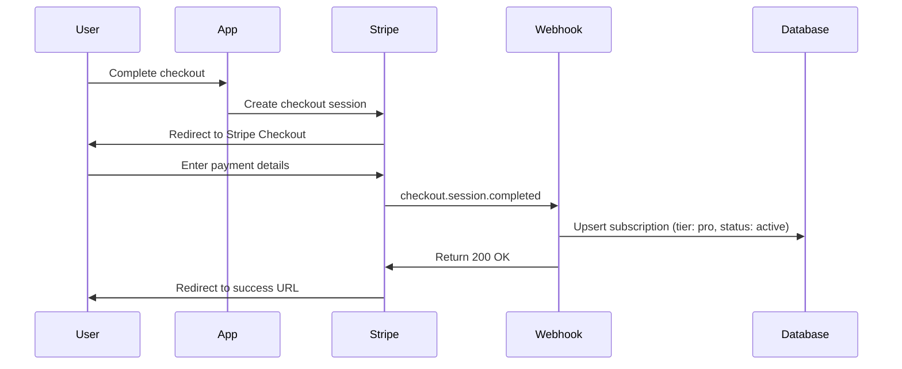

# Svolta API Reference

**Version:** 1.1.0
**Last Updated:** 2026-01-04
**Base URL:** `https://www.svolta.app/api` (Production) | `http://localhost:3000/api` (Development)

## Overview

Svolta's REST API provides endpoints for Stripe payment integration, usage tracking, and account management. All endpoints require authentication via Supabase Auth JWT tokens unless otherwise specified.

**Key Features:**

- Stripe Checkout and subscription management
- Usage tracking with free tier limits (5 exports/month)
- Account deletion with cascading data cleanup
- Webhook handling for subscription lifecycle events

**Tech Stack:**

- **Framework:** Next.js 16 API Routes (App Router)
- **Authentication:** Supabase Auth (JWT Bearer tokens)
- **Payments:** Stripe Checkout + Customer Portal
- **Database:** PostgreSQL via Supabase

---

## Table of Contents

1. [Authentication](#authentication)
2. [Endpoints](#endpoints)
   - [Stripe Checkout](#post-apistripecheckout)
   - [Stripe Webhook](#post-apistripewebhook)
   - [Stripe Portal](#post-apistripeportal)
   - [Get Usage](#get-apiusage)
   - [Increment Usage](#post-apiusageincrement)
   - [Delete Account](#delete-apiaccountdelete)
   - [Debug Alignment Log](#debug-alignment-log-development-only)
3. [Error Handling](#error-handling)
4. [Rate Limiting](#rate-limiting)
5. [Webhooks](#webhooks)

---

## Authentication

All API endpoints (except webhook) require authentication via Supabase Auth JWT tokens.

### Header Format

```http
Authorization: Bearer <your_jwt_token>
```

### Obtaining Tokens

Tokens are automatically managed by Supabase client libraries:

```typescript
// Client-side example
import { createClient } from "@/lib/supabase/client";

const supabase = createClient();
const {
  data: { session },
} = await supabase.auth.getSession();
const token = session?.access_token;
```

### Token Lifecycle

- **Expiration:** 1 hour
- **Refresh:** Automatic via Supabase client
- **Scope:** User-specific data access (Row Level Security)

---

## Endpoints

### POST /api/stripe/checkout

Create a Stripe Checkout session for upgrading to Pro or Team tier.

**Authentication:** Required (Bearer token)

#### Request Body

```typescript
{
  priceId: string; // Stripe Price ID (e.g., 'price_1ABC123')
}
```

#### Response

**Success (200 OK):**

```json
{
  "url": "https://checkout.stripe.com/c/pay/cs_test_..."
}
```

**Error Responses:** See [Error Handling](#error-handling)

#### Example

```typescript
const response = await fetch("/api/stripe/checkout", {
  method: "POST",
  headers: {
    "Content-Type": "application/json",
    Authorization: `Bearer ${token}`,
  },
  body: JSON.stringify({
    priceId: process.env.NEXT_PUBLIC_STRIPE_PRO_PRICE_ID,
  }),
});

const { url } = await response.json();
window.location.href = url; // Redirect to Stripe Checkout
```

#### Behavior

1. Validates user authentication
2. Creates or retrieves Stripe customer ID
3. Stores `stripe_customer_id` in `profiles` table
4. Creates Checkout session with metadata (`user_id`)
5. Configures success/cancel redirect URLs
6. Allows promotion codes

#### Error Codes

| Status | Error                               | Description                       |
| ------ | ----------------------------------- | --------------------------------- |
| 401    | `Unauthorized`                      | Missing or invalid JWT token      |
| 400    | `Price ID is required`              | Missing `priceId` in request body |
| 500    | `Failed to create checkout session` | Stripe API error or server error  |

---

### POST /api/stripe/webhook

Handle Stripe webhook events for subscription lifecycle management.

**Authentication:** None (Stripe signature verification)

#### Headers

```http
stripe-signature: t=1234567890,v1=abcdef...
```

#### Supported Events

| Event Type                      | Description                     | Database Action                                     |
| ------------------------------- | ------------------------------- | --------------------------------------------------- |
| `checkout.session.completed`    | Checkout completed successfully | Upsert subscription (tier: `pro`, status: `active`) |
| `customer.subscription.updated` | Subscription status changed     | Update subscription tier/status                     |
| `customer.subscription.deleted` | Subscription canceled           | Set tier to `free`, status to `canceled`            |
| `invoice.payment_failed`        | Payment failed                  | Set status to `past_due`                            |
| `invoice.payment_succeeded`     | Payment succeeded               | Set status to `active`                              |

#### Response

**Success (200 OK):**

```json
{
  "received": true
}
```

**Error Responses:**

```json
{
  "error": "Missing stripe-signature header"
}
```

#### Example (Stripe CLI Testing)

```bash
stripe listen --forward-to localhost:3000/api/stripe/webhook
stripe trigger checkout.session.completed
```

#### Behavior

1. Validates webhook signature using `STRIPE_WEBHOOK_SECRET`
2. Parses event type and data
3. Updates `subscriptions` table via Supabase Admin client
4. Logs unhandled event types
5. Returns 200 status to acknowledge receipt

#### Error Codes

| Status | Error                             | Description                           |
| ------ | --------------------------------- | ------------------------------------- |
| 400    | `Missing stripe-signature header` | No signature in request headers       |
| 400    | `Invalid signature`               | Signature verification failed         |
| 500    | `Webhook handler failed`          | Database update error or server error |

---

### POST /api/stripe/portal

Create a Stripe Customer Portal session for managing subscriptions.

**Authentication:** Required (Bearer token)

#### Request Body

None (empty POST request)

#### Response

**Success (200 OK):**

```json
{
  "url": "https://billing.stripe.com/p/session/test_..."
}
```

**Error Responses:**

```json
{
  "error": "No active subscription found"
}
```

#### Example

```typescript
const response = await fetch("/api/stripe/portal", {
  method: "POST",
  headers: {
    Authorization: `Bearer ${token}`,
  },
});

const { url } = await response.json();
window.location.href = url; // Redirect to Stripe Customer Portal
```

#### Behavior

1. Validates user authentication
2. Retrieves `stripe_customer_id` from `profiles` table
3. Creates Customer Portal session
4. Configures return URL to `/settings`

#### Portal Capabilities

- Update payment method
- View invoice history
- Cancel subscription
- Update billing address

#### Error Codes

| Status | Error                             | Description                      |
| ------ | --------------------------------- | -------------------------------- |
| 401    | `Unauthorized`                    | Missing or invalid JWT token     |
| 400    | `No active subscription found`    | User has no `stripe_customer_id` |
| 500    | `Failed to create portal session` | Stripe API error or server error |

---

### GET /api/usage

Get current month's export usage statistics for authenticated user.

**Authentication:** Required (Bearer token)

#### Request Body

None (GET request)

#### Response

**Success (200 OK):**

```json
{
  "exports_count": 3,
  "period_start": "2025-12",
  "limit": 5,
  "remaining": 2,
  "is_pro": false,
  "last_export_at": "2025-12-22T16:30:00.000Z"
}
```

**Pro User Response:**

```json
{
  "exports_count": 47,
  "period_start": "2025-12",
  "limit": -1,
  "remaining": -1,
  "is_pro": true,
  "last_export_at": "2025-12-22T18:45:00.000Z"
}
```

#### Response Fields

| Field            | Type           | Description                                             |
| ---------------- | -------------- | ------------------------------------------------------- |
| `exports_count`  | number         | Number of exports this month                            |
| `period_start`   | string         | Current month in `YYYY-MM` format                       |
| `limit`          | number         | Monthly export limit (`5` for free, `-1` for unlimited) |
| `remaining`      | number         | Remaining exports this month (`-1` for unlimited)       |
| `is_pro`         | boolean        | Whether user has active Pro subscription                |
| `last_export_at` | string \| null | ISO 8601 timestamp of last export                       |

#### Example

```typescript
const response = await fetch("/api/usage", {
  headers: {
    Authorization: `Bearer ${token}`,
  },
});

const usage = await response.json();
console.log(`${usage.remaining} exports remaining`);
```

#### Behavior

1. Validates user authentication
2. Fetches subscription tier from `subscriptions` table
3. Queries `usage` table for current month (`YYYY-MM`)
4. Returns `0` exports if no record exists (new month)
5. Calculates remaining exports for free users

#### Error Codes

| Status | Error                        | Description                  |
| ------ | ---------------------------- | ---------------------------- |
| 401    | `Unauthorized`               | Missing or invalid JWT token |
| 500    | `Failed to fetch usage data` | Database query error         |
| 500    | `Internal server error`      | Unexpected server error      |

---

### POST /api/usage/increment

Increment the export count for the current month.

**Authentication:** Required (Bearer token)

#### Request Body

None (empty POST request)

#### Response

**Success (200 OK):**

```json
{
  "success": true,
  "exports_count": 4,
  "remaining": 1,
  "can_export": true,
  "limit_reached": false
}
```

**Limit Reached (403 Forbidden):**

```json
{
  "error": "Export limit reached",
  "message": "You've reached your limit of 5 exports per month. Upgrade to Pro for unlimited exports.",
  "exports_count": 5,
  "remaining": 0,
  "can_export": false,
  "limit_reached": true
}
```

#### Response Fields

| Field           | Type    | Description                            |
| --------------- | ------- | -------------------------------------- |
| `success`       | boolean | Whether increment succeeded            |
| `exports_count` | number  | Updated export count                   |
| `remaining`     | number  | Remaining exports (`-1` for unlimited) |
| `can_export`    | boolean | Whether user can export more           |
| `limit_reached` | boolean | Whether free tier limit reached        |

#### Example

```typescript
const response = await fetch("/api/usage/increment", {
  method: "POST",
  headers: {
    Authorization: `Bearer ${token}`,
  },
});

if (response.status === 403) {
  // Show upgrade prompt
  const { message } = await response.json();
  alert(message);
} else {
  // Proceed with export
  const { exports_count } = await response.json();
  console.log(`Export ${exports_count} successful`);
}
```

#### Behavior

1. Validates user authentication
2. Fetches subscription tier from `subscriptions` table
3. Checks current month's export count
4. **Free users:** Returns 403 if limit (5) reached
5. **Pro users:** Always allows increment (unlimited)
6. Upserts `usage` record (increments or creates)
7. Updates `last_export_at` timestamp

#### Error Codes

| Status | Error                         | Description                               |
| ------ | ----------------------------- | ----------------------------------------- |
| 401    | `Unauthorized`                | Missing or invalid JWT token              |
| 403    | `Export limit reached`        | Free tier limit (5 exports/month) reached |
| 500    | `Failed to update usage data` | Database upsert error                     |
| 500    | `Internal server error`       | Unexpected server error                   |

---

### DELETE /api/account/delete

Permanently delete the user's account and all associated data.

**Authentication:** Required (Bearer token)

**⚠️ Warning:** This action is irreversible and will:

- Cancel all active Stripe subscriptions
- Delete usage records
- Delete subscription records
- Delete profile
- Delete uploaded logos from storage
- Delete auth user

#### Request Body

None (empty DELETE request)

#### Response

**Success (200 OK):**

```json
{
  "success": true,
  "message": "Account deleted successfully"
}
```

**Error Responses:**

```json
{
  "error": "Failed to delete account"
}
```

#### Example

```typescript
const confirmed = confirm(
  "Are you sure you want to delete your account? This action cannot be undone.",
);

if (confirmed) {
  const response = await fetch("/api/account/delete", {
    method: "DELETE",
    headers: {
      Authorization: `Bearer ${token}`,
    },
  });

  if (response.ok) {
    // Redirect to homepage
    window.location.href = "/";
  }
}
```

#### Behavior (Execution Order)

1. Validates user authentication
2. Retrieves `stripe_customer_id` from `profiles`
3. **Stripe:** Cancels all active subscriptions
4. **Database:** Deletes `usage` records
5. **Database:** Deletes `subscriptions` records
6. **Database:** Deletes `profiles` record
7. **Storage:** Deletes uploaded logos from `logos` bucket
8. **Auth:** Deletes auth user (must be last)

#### Deletion Cascade

| Resource              | Action   | Notes                               |
| --------------------- | -------- | ----------------------------------- |
| Stripe subscriptions  | Canceled | Customer record retained in Stripe  |
| `usage` table         | Deleted  | All historical export counts        |
| `subscriptions` table | Deleted  | Subscription status and tier        |
| `profiles` table      | Deleted  | User profile and Stripe customer ID |
| Storage (`logos/*`)   | Deleted  | All uploaded logo files             |
| Auth user             | Deleted  | Supabase Auth account               |

#### Error Codes

| Status | Error                      | Description                  |
| ------ | -------------------------- | ---------------------------- |
| 401    | `Unauthorized`             | Missing or invalid JWT token |
| 500    | `Failed to delete account` | Auth user deletion failed    |
| 500    | `Internal server error`    | Unexpected server error      |

---

### Debug Alignment Log (Development Only)

Debug endpoints for alignment logging. These endpoints only work in development mode (`NODE_ENV=development`).

#### GET /api/debug/alignment-log

Read all alignment log entries.

**Authentication:** None required

**Response (200 OK):**

```json
{
  "success": true,
  "entriesCount": 3,
  "logs": [
    {
      "timestamp": "2026-01-04T10:30:45.123Z",
      "input": {
        "beforeImg": { "width": 1536, "height": 2048 },
        "afterImg": { "width": 1536, "height": 2048 },
        "targetWidth": 1080,
        "targetHeight": 1350,
        "beforeLandmarks": { "count": 33, "nose": {...}, "shoulders": {...} },
        "afterLandmarks": { "count": 33, "nose": {...}, "shoulders": {...} }
      },
      "result": {
        "before": { "drawX": -11, "drawY": -91, "drawWidth": 1164, "drawHeight": 1552 },
        "after": { "drawX": -308, "drawY": -556, "drawWidth": 1719, "drawHeight": 2293 },
        "useShoulderAlignment": false,
        "cropTopOffset": 0
      },
      "metadata": { "source": "png" }
    }
  ]
}
```

**Response (403 Forbidden - Production):**

```json
{
  "error": "Debug logging disabled in production"
}
```

---

#### POST /api/debug/alignment-log

Append a new alignment log entry.

**Authentication:** None required

**Request Body:**

```json
{
  "timestamp": "2026-01-04T10:30:45.123Z",
  "input": { ... },
  "result": { ... },
  "metadata": { "source": "png" }
}
```

**Response (200 OK):**

```json
{
  "success": true,
  "entriesCount": 4,
  "path": "debug/alignment-log.json"
}
```

---

#### DELETE /api/debug/alignment-log

Clear all alignment log entries.

**Authentication:** None required

**Response (200 OK):**

```json
{
  "success": true,
  "message": "Log file deleted"
}
```

---

#### Enabling Debug Logging

Debug logging is controlled by localStorage or environment variable:

```javascript
// Browser console:
window.svoltaDebug.enable(); // Enable
window.svoltaDebug.disable(); // Disable
window.svoltaDebug.isEnabled(); // Check status

// Or localStorage:
localStorage.setItem("svolta_debug_alignment", "true");

// Or environment variable (.env.local):
NEXT_PUBLIC_DEBUG_ALIGNMENT = true;
```

**Key Files:**

- `/lib/debug/alignment-logger.ts` - Debug utility module
- `/app/api/debug/alignment-log/route.ts` - File writing API

---

## Error Handling

### Standard Error Response Format

```json
{
  "error": "Error code or message"
}
```

### Error Response with Context

```json
{
  "error": "Export limit reached",
  "message": "You've reached your limit of 5 exports per month. Upgrade to Pro for unlimited exports.",
  "exports_count": 5,
  "remaining": 0
}
```

### Common HTTP Status Codes

| Status | Meaning               | Typical Cause                                     |
| ------ | --------------------- | ------------------------------------------------- |
| 200    | OK                    | Request succeeded                                 |
| 400    | Bad Request           | Missing required parameters                       |
| 401    | Unauthorized          | Invalid or missing JWT token                      |
| 403    | Forbidden             | Action not allowed (e.g., export limit reached)   |
| 500    | Internal Server Error | Database error, Stripe API error, or server error |

### Error Handling Best Practices

```typescript
async function callAPI() {
  try {
    const response = await fetch("/api/usage/increment", {
      method: "POST",
      headers: { Authorization: `Bearer ${token}` },
    });

    if (!response.ok) {
      const error = await response.json();

      if (response.status === 403) {
        // Show upgrade prompt
        showUpgradeModal(error.message);
      } else if (response.status === 401) {
        // Redirect to login
        window.location.href = "/login";
      } else {
        // Show generic error
        alert(error.error);
      }
      return;
    }

    const data = await response.json();
    // Handle success
  } catch (error) {
    console.error("Network error:", error);
  }
}
```

---

## Rate Limiting

**Current Status:** No rate limiting implemented

**Recommended Future Implementation:**

- **Authentication endpoints:** 5 requests/minute per IP
- **Payment endpoints:** 10 requests/minute per user
- **Usage endpoints:** 30 requests/minute per user
- **Webhook endpoint:** No limit (Stripe-controlled)

---

## Webhooks

### Stripe Webhook Configuration

**Endpoint:** `https://www.svolta.app/api/stripe/webhook`

**Required Events:**

- `checkout.session.completed`
- `customer.subscription.updated`
- `customer.subscription.deleted`
- `invoice.payment_failed`
- `invoice.payment_succeeded`

### Setup Instructions

1. **Get webhook secret:**

   ```bash
   stripe listen --print-secret
   ```

2. **Add to environment variables:**

   ```bash
   STRIPE_WEBHOOK_SECRET=whsec_...
   ```

3. **Configure webhook in Stripe Dashboard:**
   - URL: `https://www.svolta.app/api/stripe/webhook`
   - Events: Select events listed above
   - API Version: Use latest

4. **Test locally:**
   ```bash
   stripe listen --forward-to localhost:3000/api/stripe/webhook
   stripe trigger checkout.session.completed
   ```

### Webhook Security

- **Signature Verification:** Every webhook validates `stripe-signature` header
- **Replay Protection:** Stripe's timestamp validation prevents replay attacks
- **Idempotency:** Upsert operations ensure duplicate events are handled safely

### Webhook Event Flow



---

## API Versioning

**Current Version:** 1.0.0

**Versioning Strategy:**

- **URL-based versioning** (planned for breaking changes)
- **Backward compatibility** maintained within major versions
- **Deprecation notices** provided 90 days before removal

**Future Versioning:**

```
/api/v1/usage          (current)
/api/v2/usage          (future breaking changes)
```

---

## Development

### Environment Variables

```bash
# Supabase
NEXT_PUBLIC_SUPABASE_URL=https://xxx.supabase.co
NEXT_PUBLIC_SUPABASE_ANON_KEY=eyJ...
SUPABASE_SERVICE_ROLE_KEY=eyJ...  # Admin operations

# Stripe
NEXT_PUBLIC_STRIPE_PUBLISHABLE_KEY=pk_test_...
STRIPE_SECRET_KEY=sk_test_...
STRIPE_WEBHOOK_SECRET=whsec_...
NEXT_PUBLIC_STRIPE_PRO_PRICE_ID=price_...

# App
NEXT_PUBLIC_APP_URL=http://localhost:3000
```

### Local Testing

```bash
# Start development server
npm run dev

# Test API endpoints
curl http://localhost:3000/api/usage \
  -H "Authorization: Bearer YOUR_JWT_TOKEN"

# Test webhooks with Stripe CLI
stripe listen --forward-to localhost:3000/api/stripe/webhook
stripe trigger checkout.session.completed
```

### Database Schema

**tables:**

- `profiles` - User profiles with `stripe_customer_id`
- `subscriptions` - Subscription tier and status
- `usage` - Monthly export counts

**RLS Policies:**

- Users can only access their own data
- Webhook endpoint uses service role key to bypass RLS

---

## Support

**Documentation:** https://www.svolta.app/docs
**GitHub Issues:** https://github.com/rickydwilson/Svolta/issues
**Email:** hello@svolta.app

---

**Last Updated:** 2026-01-04
**API Version:** 1.1.0
**Next.js Version:** 16.1.1
**Supabase SDK:** Latest
