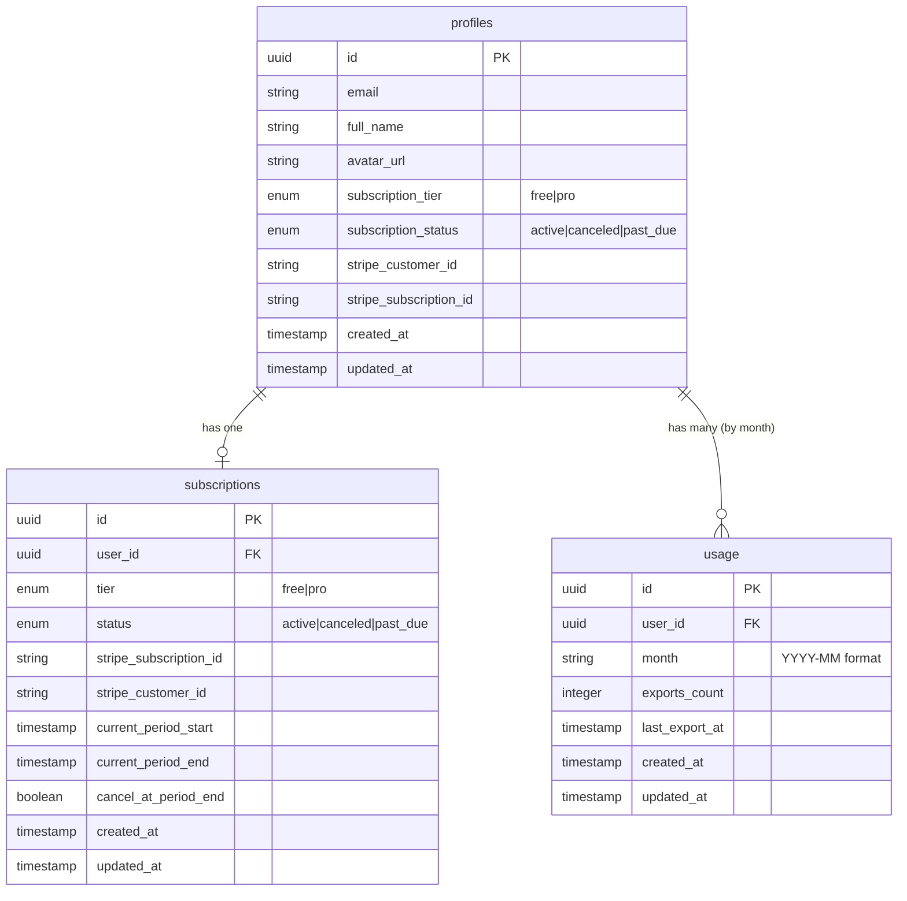

# Database Schema

**Version:** 1.1.0
**Last Updated:** 2026-01-04
**Scope:** Supabase database schema, tables, RPC functions, and Row Level Security policies

## Table of Contents

1. [Overview](#overview)
2. [Entity Relationship Diagram](#entity-relationship-diagram)
3. [Tables](#tables)
4. [RPC Functions](#rpc-functions)
5. [Row Level Security Policies](#row-level-security-policies)
6. [Triggers & Automation](#triggers--automation)
7. [Usage Patterns](#usage-patterns)

---

## Overview

Svolta uses Supabase (PostgreSQL) for data persistence with four primary tables:

| Table            | Purpose                                | Records              |
| ---------------- | -------------------------------------- | -------------------- |
| `profiles`       | User profile and subscription metadata | 1 per user           |
| `subscriptions`  | Detailed subscription information      | 1 per user           |
| `usage`          | Monthly export tracking                | 1 per user per month |
| `webhook_events` | Stripe webhook idempotency tracking    | 1 per webhook event  |

**Key Design Principles:**

- **User Privacy:** No photos or landmarks stored
- **Row Level Security:** Enforced at database level
- **Stripe Sync:** Subscription data synchronized via webhooks
- **Monthly Reset:** Usage tracked by calendar month

---

## Entity Relationship Diagram



**Relationships:**

- `profiles.id` → `auth.users.id` (1:1, Supabase Auth integration)
- `subscriptions.user_id` → `profiles.id` (1:1, optional)
- `usage.user_id` → `profiles.id` (1:many, monthly records)

---

## Tables

### `profiles`

User profile and subscription metadata synchronized with Stripe.

**Schema:**

```sql
CREATE TABLE profiles (
  id UUID PRIMARY KEY REFERENCES auth.users(id) ON DELETE CASCADE,
  email TEXT NOT NULL,
  full_name TEXT,
  avatar_url TEXT,
  subscription_tier TEXT DEFAULT 'free' CHECK (subscription_tier IN ('free', 'pro')),
  subscription_status TEXT CHECK (subscription_status IN ('active', 'canceled', 'past_due')),
  stripe_customer_id TEXT UNIQUE,
  stripe_subscription_id TEXT UNIQUE,
  created_at TIMESTAMPTZ DEFAULT NOW(),
  updated_at TIMESTAMPTZ DEFAULT NOW()
);

-- Indexes
CREATE INDEX idx_profiles_stripe_customer ON profiles(stripe_customer_id);
CREATE INDEX idx_profiles_subscription_tier ON profiles(subscription_tier);
```

**Columns:**

| Column                   | Type          | Nullable | Description                              |
| ------------------------ | ------------- | -------- | ---------------------------------------- |
| `id`                     | `uuid`        | No       | User ID (references `auth.users.id`)     |
| `email`                  | `text`        | No       | User email (synced from auth.users)      |
| `full_name`              | `text`        | Yes      | User's full name                         |
| `avatar_url`             | `text`        | Yes      | Profile avatar URL                       |
| `subscription_tier`      | `enum`        | No       | Current tier: `free` or `pro`            |
| `subscription_status`    | `enum`        | Yes      | Status: `active`, `canceled`, `past_due` |
| `stripe_customer_id`     | `text`        | Yes      | Stripe customer ID (unique)              |
| `stripe_subscription_id` | `text`        | Yes      | Stripe subscription ID (unique)          |
| `created_at`             | `timestamptz` | No       | Record creation timestamp                |
| `updated_at`             | `timestamptz` | No       | Last update timestamp                    |

**Enums:**

```sql
CREATE TYPE subscription_tier AS ENUM ('free', 'pro');
CREATE TYPE subscription_status AS ENUM ('active', 'canceled', 'past_due');
```

**TypeScript Type:**

```typescript
export interface Profile {
  id: string;
  email: string;
  full_name: string | null;
  avatar_url: string | null;
  subscription_tier: "free" | "pro";
  subscription_status: "active" | "canceled" | "past_due" | null;
  stripe_customer_id: string | null;
  stripe_subscription_id: string | null;
  created_at: string;
  updated_at: string;
}
```

**Example:**

```typescript
// Fetch user profile
const { data: profile } = await supabase
  .from("profiles")
  .select("*")
  .eq("id", user.id)
  .single();

console.log(profile.subscription_tier); // 'free' or 'pro'
```

---

### `subscriptions`

Detailed subscription information with Stripe synchronization.

**Schema:**

```sql
CREATE TABLE subscriptions (
  id UUID PRIMARY KEY DEFAULT gen_random_uuid(),
  user_id UUID NOT NULL REFERENCES profiles(id) ON DELETE CASCADE,
  tier TEXT DEFAULT 'free' CHECK (tier IN ('free', 'pro')),
  status TEXT DEFAULT 'active' CHECK (status IN ('active', 'canceled', 'past_due')),
  stripe_subscription_id TEXT UNIQUE,
  stripe_customer_id TEXT,
  current_period_start TIMESTAMPTZ,
  current_period_end TIMESTAMPTZ,
  cancel_at_period_end BOOLEAN DEFAULT FALSE,
  created_at TIMESTAMPTZ DEFAULT NOW(),
  updated_at TIMESTAMPTZ DEFAULT NOW()
);

-- Indexes
CREATE UNIQUE INDEX idx_subscriptions_user ON subscriptions(user_id);
CREATE INDEX idx_subscriptions_stripe ON subscriptions(stripe_subscription_id);
CREATE INDEX idx_subscriptions_status ON subscriptions(status);
```

**Columns:**

| Column                   | Type          | Nullable | Description                                |
| ------------------------ | ------------- | -------- | ------------------------------------------ |
| `id`                     | `uuid`        | No       | Subscription record ID                     |
| `user_id`                | `uuid`        | No       | User ID (references `profiles.id`)         |
| `tier`                   | `enum`        | No       | Subscription tier: `free` or `pro`         |
| `status`                 | `enum`        | No       | Status: `active`, `canceled`, `past_due`   |
| `stripe_subscription_id` | `text`        | Yes      | Stripe subscription ID (unique)            |
| `stripe_customer_id`     | `text`        | Yes      | Stripe customer ID                         |
| `current_period_start`   | `timestamptz` | Yes      | Billing period start date                  |
| `current_period_end`     | `timestamptz` | Yes      | Billing period end date                    |
| `cancel_at_period_end`   | `boolean`     | No       | Whether subscription cancels at period end |
| `created_at`             | `timestamptz` | No       | Record creation timestamp                  |
| `updated_at`             | `timestamptz` | No       | Last update timestamp                      |

**TypeScript Type:**

```typescript
export interface Subscription {
  id: string;
  user_id: string;
  tier: "free" | "pro";
  status: "active" | "canceled" | "past_due";
  stripe_subscription_id: string | null;
  stripe_customer_id: string | null;
  current_period_start: string | null;
  current_period_end: string | null;
  cancel_at_period_end: boolean;
  created_at: string;
  updated_at: string;
}
```

**Example:**

```typescript
// Fetch user subscription
const { data: subscription } = await supabase
  .from("subscriptions")
  .select("*")
  .eq("user_id", user.id)
  .single();

console.log(subscription.status); // 'active', 'canceled', or 'past_due'
console.log(subscription.current_period_end); // Next billing date
```

---

### `usage`

Monthly export tracking with automatic reset each calendar month.

**Schema:**

```sql
CREATE TABLE usage (
  id UUID PRIMARY KEY DEFAULT gen_random_uuid(),
  user_id UUID NOT NULL REFERENCES profiles(id) ON DELETE CASCADE,
  month TEXT NOT NULL, -- Format: 'YYYY-MM'
  exports_count INTEGER DEFAULT 0,
  last_export_at TIMESTAMPTZ,
  created_at TIMESTAMPTZ DEFAULT NOW(),
  updated_at TIMESTAMPTZ DEFAULT NOW(),
  UNIQUE(user_id, month)
);

-- Indexes
CREATE INDEX idx_usage_user_month ON usage(user_id, month);
CREATE INDEX idx_usage_month ON usage(month);
```

**Columns:**

| Column           | Type          | Nullable | Description                                 |
| ---------------- | ------------- | -------- | ------------------------------------------- |
| `id`             | `uuid`        | No       | Usage record ID                             |
| `user_id`        | `uuid`        | No       | User ID (references `profiles.id`)          |
| `month`          | `text`        | No       | Month in `YYYY-MM` format (e.g., `2025-12`) |
| `exports_count`  | `integer`     | No       | Number of exports this month                |
| `last_export_at` | `timestamptz` | Yes      | Timestamp of last export                    |
| `created_at`     | `timestamptz` | No       | Record creation timestamp                   |
| `updated_at`     | `timestamptz` | No       | Last update timestamp                       |

**Constraints:**

- `UNIQUE(user_id, month)` - One record per user per month

**TypeScript Type:**

```typescript
export interface Usage {
  id: string;
  user_id: string;
  month: string; // 'YYYY-MM'
  exports_count: number;
  last_export_at: string | null;
  created_at: string;
  updated_at: string;
}
```

**Example:**

```typescript
// Fetch current month usage
const currentMonth = new Date().toISOString().slice(0, 7); // '2025-12'

const { data: usage } = await supabase
  .from("usage")
  .select("*")
  .eq("user_id", user.id)
  .eq("month", currentMonth)
  .single();

console.log(usage?.exports_count ?? 0); // 0-5 for free, unlimited for pro
```

---

### `webhook_events`

Stripe webhook idempotency tracking to prevent duplicate event processing.

**Schema:**

```sql
CREATE TABLE webhook_events (
  id UUID PRIMARY KEY DEFAULT gen_random_uuid(),
  stripe_event_id TEXT NOT NULL UNIQUE,
  event_type TEXT NOT NULL,
  processed_at TIMESTAMPTZ DEFAULT NOW()
);

-- Indexes
CREATE INDEX idx_webhook_events_stripe_id ON webhook_events(stripe_event_id);
```

**Columns:**

| Column            | Type          | Nullable | Description                                     |
| ----------------- | ------------- | -------- | ----------------------------------------------- |
| `id`              | `uuid`        | No       | Record ID                                       |
| `stripe_event_id` | `text`        | No       | Stripe event ID (e.g., `evt_xxxxx`)             |
| `event_type`      | `text`        | No       | Event type (e.g., `checkout.session.completed`) |
| `processed_at`    | `timestamptz` | No       | When the event was processed                    |

**Constraints:**

- `UNIQUE(stripe_event_id)` - Each Stripe event processed only once

**TypeScript Type:**

```typescript
export interface WebhookEvent {
  id: string;
  stripe_event_id: string;
  event_type: string;
  processed_at: string;
}
```

**Example:**

```typescript
// Check if event was already processed
const { data: existingEvent } = await supabase
  .from("webhook_events")
  .select("id")
  .eq("stripe_event_id", event.id)
  .single();

if (existingEvent) {
  // Skip duplicate event
  return { duplicate: true };
}

// Record new event before processing
await supabase.from("webhook_events").insert({
  stripe_event_id: event.id,
  event_type: event.type,
});
```

**Purpose:**

Stripe webhooks can be delivered multiple times (retries, network issues). This table ensures:

- Each event is processed exactly once
- Race conditions are handled via unique constraint
- Audit trail of processed events is maintained

---

## RPC Functions

Supabase RPC (Remote Procedure Call) functions for complex operations.

### `increment_export_count`

Atomically increments export count and checks limits.

**Function:**

```sql
CREATE OR REPLACE FUNCTION increment_export_count(p_user_id UUID)
RETURNS TABLE (
  exports_count INTEGER,
  remaining INTEGER,
  limit_reached BOOLEAN
) AS $$
DECLARE
  v_current_count INTEGER;
  v_tier TEXT;
  v_limit INTEGER := 5; -- Free tier limit
  v_month TEXT := TO_CHAR(NOW(), 'YYYY-MM');
BEGIN
  -- Get user tier
  SELECT subscription_tier INTO v_tier
  FROM profiles
  WHERE id = p_user_id;

  -- Pro users have unlimited exports
  IF v_tier = 'pro' THEN
    RETURN QUERY SELECT 0, 999999, FALSE;
  END IF;

  -- Upsert usage record
  INSERT INTO usage (user_id, month, exports_count, last_export_at)
  VALUES (p_user_id, v_month, 1, NOW())
  ON CONFLICT (user_id, month)
  DO UPDATE SET
    exports_count = usage.exports_count + 1,
    last_export_at = NOW()
  RETURNING usage.exports_count INTO v_current_count;

  -- Return usage info
  RETURN QUERY SELECT
    v_current_count,
    GREATEST(0, v_limit - v_current_count),
    v_current_count >= v_limit;
END;
$$ LANGUAGE plpgsql SECURITY DEFINER;
```

**Usage:**

```typescript
const { data, error } = await supabase.rpc("increment_export_count", {
  p_user_id: user.id,
});

console.log(data.exports_count); // Current month count
console.log(data.remaining); // Exports remaining
console.log(data.limit_reached); // Whether limit hit
```

**Returns:**

```typescript
{
  exports_count: number; // Current month exports
  remaining: number; // Exports remaining (999999 for pro)
  limit_reached: boolean; // true if limit reached
}
```

---

### `get_current_usage`

Fetches current month usage without incrementing.

**Function:**

```sql
CREATE OR REPLACE FUNCTION get_current_usage(p_user_id UUID)
RETURNS TABLE (
  exports_count INTEGER,
  exports_limit INTEGER,
  remaining INTEGER
) AS $$
DECLARE
  v_tier TEXT;
  v_count INTEGER := 0;
  v_limit INTEGER := 5;
  v_month TEXT := TO_CHAR(NOW(), 'YYYY-MM');
BEGIN
  -- Get user tier
  SELECT subscription_tier INTO v_tier
  FROM profiles
  WHERE id = p_user_id;

  -- Pro users have unlimited
  IF v_tier = 'pro' THEN
    RETURN QUERY SELECT 0, 999999, 999999;
  END IF;

  -- Get current month usage
  SELECT COALESCE(u.exports_count, 0) INTO v_count
  FROM usage u
  WHERE u.user_id = p_user_id
    AND u.month = v_month;

  -- Return usage info
  RETURN QUERY SELECT
    v_count,
    v_limit,
    GREATEST(0, v_limit - v_count);
END;
$$ LANGUAGE plpgsql SECURITY DEFINER;
```

**Usage:**

```typescript
const { data, error } = await supabase.rpc("get_current_usage", {
  p_user_id: user.id,
});

console.log(data.exports_count); // Current month exports
console.log(data.exports_limit); // Monthly limit (5 for free, 999999 for pro)
console.log(data.remaining); // Exports remaining
```

**Returns:**

```typescript
{
  exports_count: number; // Current month exports
  exports_limit: number; // Monthly limit
  remaining: number; // Exports remaining
}
```

---

## Row Level Security Policies

All tables use Row Level Security (RLS) to enforce access control at the database level.

### `profiles` Table

**Enable RLS:**

```sql
ALTER TABLE profiles ENABLE ROW LEVEL SECURITY;
```

**Policies:**

```sql
-- Users can read their own profile
CREATE POLICY "Users can view own profile"
  ON profiles FOR SELECT
  USING (auth.uid() = id);

-- Users can update their own profile
CREATE POLICY "Users can update own profile"
  ON profiles FOR UPDATE
  USING (auth.uid() = id);

-- Service role can insert profiles (for auth trigger)
CREATE POLICY "Service role can insert profiles"
  ON profiles FOR INSERT
  WITH CHECK (auth.role() = 'service_role');
```

**Effect:**

- Users can only read/update their own profile
- Profiles created automatically by auth trigger
- Admins (service role) can manage all profiles

---

### `subscriptions` Table

**Enable RLS:**

```sql
ALTER TABLE subscriptions ENABLE ROW LEVEL SECURITY;
```

**Policies:**

```sql
-- Users can read their own subscription
CREATE POLICY "Users can view own subscription"
  ON subscriptions FOR SELECT
  USING (auth.uid() = user_id);

-- Service role can manage subscriptions (for Stripe webhooks)
CREATE POLICY "Service role can manage subscriptions"
  ON subscriptions FOR ALL
  USING (auth.role() = 'service_role');
```

**Effect:**

- Users can only read their own subscription
- Subscriptions updated via API routes with service role
- Stripe webhooks use service role for updates

---

### `usage` Table

**Enable RLS:**

```sql
ALTER TABLE usage ENABLE ROW LEVEL SECURITY;
```

**Policies:**

```sql
-- Users can read their own usage
CREATE POLICY "Users can view own usage"
  ON usage FOR SELECT
  USING (auth.uid() = user_id);

-- Users can insert/update their own usage (via RPC functions)
CREATE POLICY "Users can update own usage"
  ON usage FOR INSERT
  WITH CHECK (auth.uid() = user_id);

CREATE POLICY "Users can increment own usage"
  ON usage FOR UPDATE
  USING (auth.uid() = user_id);
```

**Effect:**

- Users can only read/update their own usage records
- Usage incremented via RPC functions or direct client calls
- Automatic monthly reset (new record per month)

---

## Triggers & Automation

### Profile Creation Trigger

Automatically creates profile when user signs up.

**Trigger:**

```sql
CREATE OR REPLACE FUNCTION public.handle_new_user()
RETURNS TRIGGER AS $$
BEGIN
  INSERT INTO public.profiles (id, email, full_name, avatar_url)
  VALUES (
    NEW.id,
    NEW.email,
    NEW.raw_user_meta_data->>'full_name',
    NEW.raw_user_meta_data->>'avatar_url'
  );
  RETURN NEW;
END;
$$ LANGUAGE plpgsql SECURITY DEFINER;

CREATE TRIGGER on_auth_user_created
  AFTER INSERT ON auth.users
  FOR EACH ROW EXECUTE FUNCTION public.handle_new_user();
```

**Effect:**

- Profile created automatically when user signs up
- Email and metadata copied from auth.users
- Default subscription tier: `free`

---

### Updated At Trigger

Updates `updated_at` timestamp on record changes.

**Trigger:**

```sql
CREATE OR REPLACE FUNCTION public.handle_updated_at()
RETURNS TRIGGER AS $$
BEGIN
  NEW.updated_at = NOW();
  RETURN NEW;
END;
$$ LANGUAGE plpgsql;

CREATE TRIGGER on_profiles_updated
  BEFORE UPDATE ON profiles
  FOR EACH ROW EXECUTE FUNCTION public.handle_updated_at();

CREATE TRIGGER on_subscriptions_updated
  BEFORE UPDATE ON subscriptions
  FOR EACH ROW EXECUTE FUNCTION public.handle_updated_at();

CREATE TRIGGER on_usage_updated
  BEFORE UPDATE ON usage
  FOR EACH ROW EXECUTE FUNCTION public.handle_updated_at();
```

**Effect:**

- `updated_at` automatically set on every update
- No need to manually update timestamps

---

## Usage Patterns

### Common Queries

#### Check if User Can Export

```typescript
const FREE_EXPORT_LIMIT = 5;

// Get current usage
const currentMonth = new Date().toISOString().slice(0, 7);
const { data: usage } = await supabase
  .from("usage")
  .select("exports_count")
  .eq("user_id", user.id)
  .eq("month", currentMonth)
  .single();

// Get user tier
const { data: profile } = await supabase
  .from("profiles")
  .select("subscription_tier, subscription_status")
  .eq("id", user.id)
  .single();

// Check if can export
const isPro =
  profile.subscription_tier === "pro" &&
  profile.subscription_status === "active";

const canExport = isPro || (usage?.exports_count ?? 0) < FREE_EXPORT_LIMIT;
```

**✅ CORRECT: Use RPC function (recommended)**

```typescript
// Simpler and atomic
const { data } = await supabase.rpc("get_current_usage", {
  p_user_id: user.id,
});

const canExport = data.remaining > 0;
```

---

#### Increment Export Count

```typescript
// Using RPC function (recommended)
const { data, error } = await supabase.rpc("increment_export_count", {
  p_user_id: user.id,
});

if (error || data.limit_reached) {
  // Show upgrade prompt
  console.log("Export limit reached");
} else {
  console.log(`${data.remaining} exports remaining`);
}
```

**❌ WRONG: Manual increment (race conditions)**

```typescript
// Don't do this - potential race condition
const { data: usage } = await supabase
  .from("usage")
  .select("exports_count")
  .eq("user_id", user.id)
  .eq("month", currentMonth)
  .single();

await supabase
  .from("usage")
  .update({ exports_count: (usage?.exports_count ?? 0) + 1 })
  .eq("user_id", user.id)
  .eq("month", currentMonth);
```

---

#### Update Subscription (Stripe Webhook)

```typescript
// In /api/stripe/webhook route
import { createClient } from "@/lib/supabase/server";

// Create service role client (bypasses RLS)
const supabase = createClient();

await supabase.from("subscriptions").upsert({
  user_id: userId,
  tier: "pro",
  status: "active",
  stripe_subscription_id: subscription.id,
  stripe_customer_id: subscription.customer,
  current_period_start: new Date(
    subscription.current_period_start * 1000,
  ).toISOString(),
  current_period_end: new Date(
    subscription.current_period_end * 1000,
  ).toISOString(),
  cancel_at_period_end: subscription.cancel_at_period_end,
});

// Also update profile for backwards compatibility
await supabase
  .from("profiles")
  .update({
    subscription_tier: "pro",
    subscription_status: "active",
    stripe_subscription_id: subscription.id,
  })
  .eq("id", userId);
```

---

## Data Migration

### Generating TypeScript Types

```bash
# Generate types from Supabase schema
npx supabase gen types typescript --project-id YOUR_PROJECT_ID > types/database.ts
```

**Output:** `types/database.ts` with full type safety.

---

## Performance Considerations

### Indexes

All critical query paths are indexed:

```sql
-- Profiles
CREATE INDEX idx_profiles_stripe_customer ON profiles(stripe_customer_id);
CREATE INDEX idx_profiles_subscription_tier ON profiles(subscription_tier);

-- Subscriptions
CREATE UNIQUE INDEX idx_subscriptions_user ON subscriptions(user_id);
CREATE INDEX idx_subscriptions_stripe ON subscriptions(stripe_subscription_id);

-- Usage
CREATE INDEX idx_usage_user_month ON usage(user_id, month);
```

### Query Optimization

**✅ CORRECT: Use RPC functions for complex logic**

```typescript
// Single round-trip, atomic operation
const { data } = await supabase.rpc("increment_export_count", {
  p_user_id: user.id,
});
```

**❌ WRONG: Multiple queries**

```typescript
// Multiple round-trips, not atomic
const profile = await supabase
  .from("profiles")
  .select("*")
  .eq("id", user.id)
  .single();
const usage = await supabase
  .from("usage")
  .select("*")
  .eq("user_id", user.id)
  .single();
// Calculate client-side, then update
```

---

## Related Documentation

- **[Architecture Overview](./overview.md)** - System architecture and data flow
- **[User Store](../../stores/user-store.ts)** - Client-side user state management
- **[API Routes](../../app/api/)** - Stripe webhooks and usage tracking

---

**Next Steps:**

1. Review [Supabase RLS documentation](https://supabase.com/docs/guides/auth/row-level-security)
2. Explore [Stripe webhook implementation](../../app/api/stripe/webhook/)
3. Test RPC functions in Supabase SQL Editor
