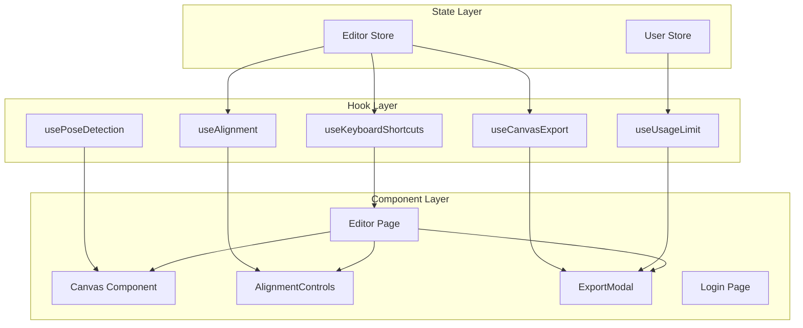
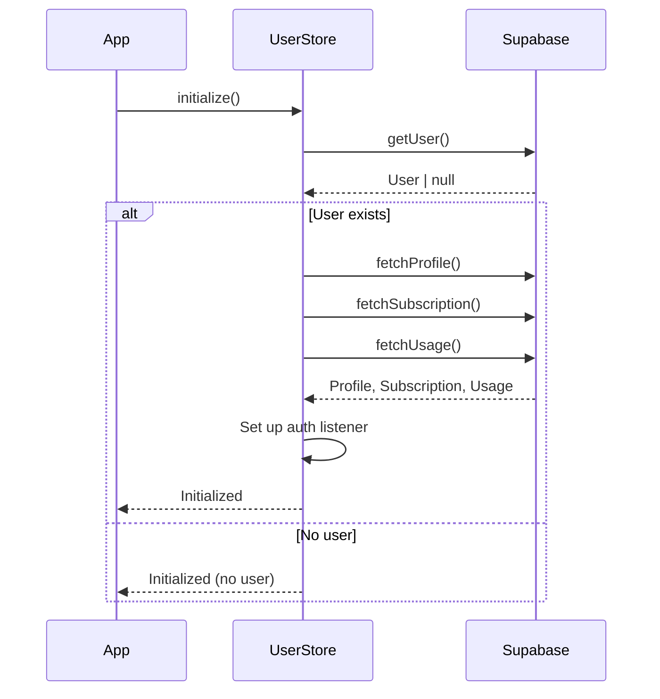
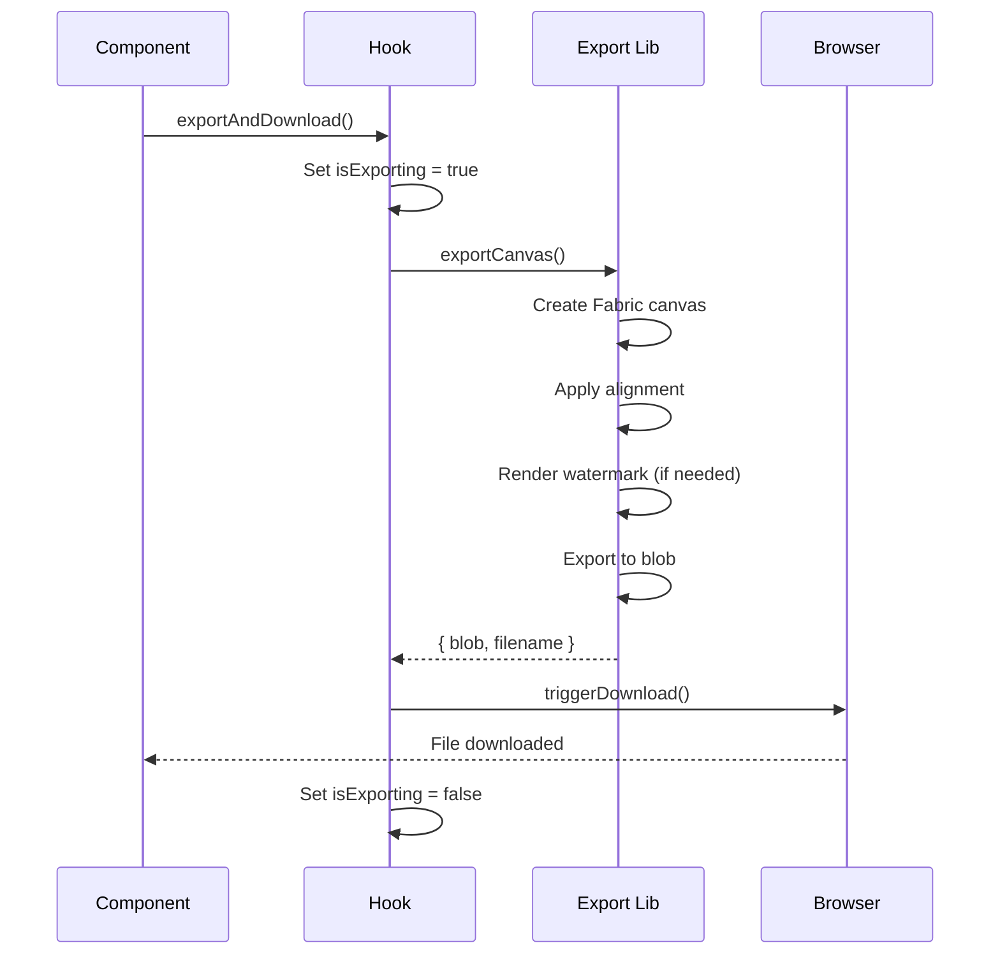
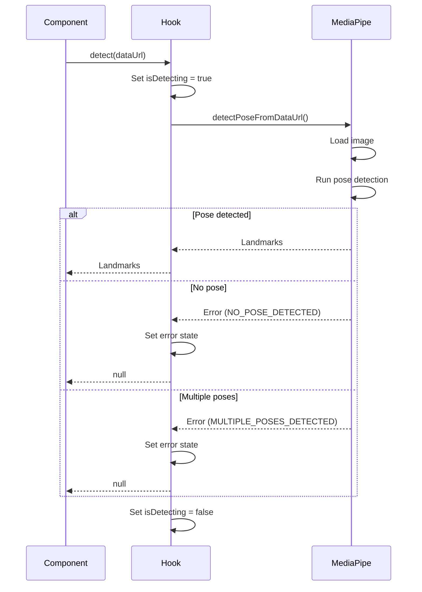
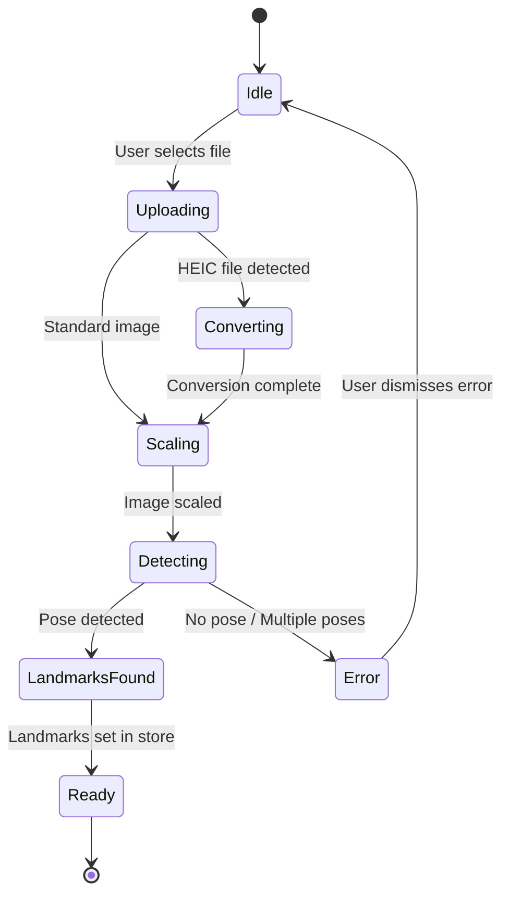
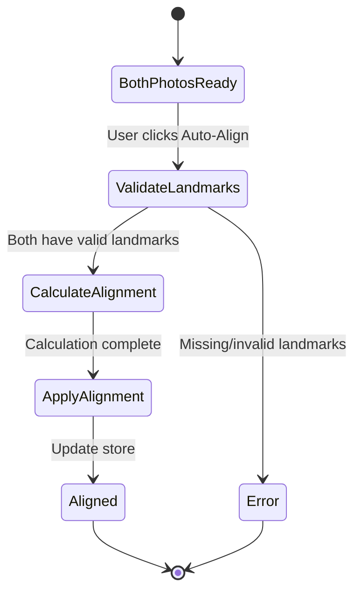
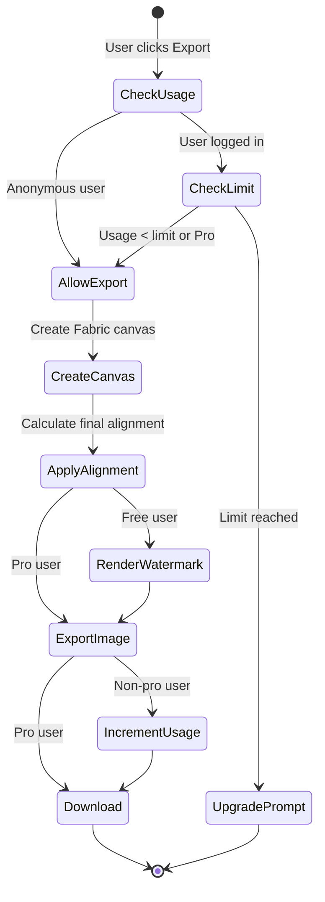

# PoseProof - State Management & Hooks

**Version:** 1.0.0
**Last Updated:** 2025-12-22
**Scope:** Zustand stores and custom React hooks architecture

## Table of Contents

- [Overview](#overview)
- [State Management (Zustand)](#state-management-zustand)
  - [Editor Store](#editor-store)
  - [User Store](#user-store)
- [Custom Hooks](#custom-hooks)
  - [useAlignment](#usealignment)
  - [useCanvasExport](#usecanvasexport)
  - [useKeyboardShortcuts](#usekeyboardshortcuts)
  - [usePoseDetection](#useposedetection)
  - [useUsageLimit](#useusagelimit)
- [State Flow Diagrams](#state-flow-diagrams)
- [Best Practices](#best-practices)

---

## Overview

PoseProof uses **Zustand** for global state management and **custom hooks** for feature-specific logic. This architecture provides:

- **Minimal boilerplate** compared to Redux
- **TypeScript-first** with full type safety
- **Devtools support** for debugging state changes
- **Separation of concerns** between state and UI logic
- **Performance** through selective subscriptions

### Architecture Diagram



---

## State Management (Zustand)

### Editor Store

**Location:** `/stores/editor-store.ts`

Manages all editor-related state including photos, landmarks, alignment settings, and UI toggles.

#### State Structure

```typescript
interface EditorState {
  // Photos
  beforePhoto: Photo | null;
  afterPhoto: Photo | null;

  // Settings
  alignment: AlignmentSettings;
  showLandmarks: boolean;
  showGrid: boolean;
  linkedZoom: boolean;

  // Status
  isDetecting: boolean;
  error: string | null;

  // Actions
  setBeforePhoto: (photo: Photo | null) => void;
  setAfterPhoto: (photo: Photo | null) => void;
  setBeforeLandmarks: (landmarks: Landmark[] | null) => void;
  setAfterLandmarks: (landmarks: Landmark[] | null) => void;
  updateAlignment: (settings: Partial<AlignmentSettings>) => void;
  toggleLandmarks: () => void;
  toggleGrid: () => void;
  toggleLinkedZoom: () => void;
  setIsDetecting: (detecting: boolean) => void;
  setError: (error: string | null) => void;
  reset: () => void;
}
```

#### Photo Type

```typescript
interface Photo {
  dataUrl: string; // Base64-encoded image
  width: number; // Original width
  height: number; // Original height
  landmarks: Landmark[] | null; // Detected pose landmarks
}
```

#### Alignment Settings

```typescript
interface AlignmentSettings {
  anchor: AnchorPoint; // 'shoulders' | 'hips' | 'head' | 'feet'
  scale: number; // 0.5 - 2.0 (100% = 1.0)
  offsetX: number; // Horizontal offset in pixels
  offsetY: number; // Vertical offset in pixels
}
```

#### Initial State

```typescript
const initialAlignment: AlignmentSettings = {
  anchor: "shoulders",
  scale: 1,
  offsetX: 0,
  offsetY: 0,
};
```

#### Usage Example

```typescript
import { useEditorStore } from '@/stores/editor-store';

function EditorComponent() {
  // Subscribe to specific state slices (re-renders only when these change)
  const beforePhoto = useEditorStore((state) => state.beforePhoto);
  const alignment = useEditorStore((state) => state.alignment);
  const showLandmarks = useEditorStore((state) => state.showLandmarks);

  // Access actions
  const setBeforePhoto = useEditorStore((state) => state.setBeforePhoto);
  const updateAlignment = useEditorStore((state) => state.updateAlignment);
  const toggleLandmarks = useEditorStore((state) => state.toggleLandmarks);

  // Update state
  const handlePhotoUpload = (photo: Photo) => {
    setBeforePhoto(photo);
  };

  const handleScaleChange = (scale: number) => {
    updateAlignment({ scale });
  };

  return (
    <div>
      {/* UI implementation */}
    </div>
  );
}
```

#### Actions Reference

| Action               | Parameters                             | Description                                      |
| -------------------- | -------------------------------------- | ------------------------------------------------ |
| `setBeforePhoto`     | `photo: Photo \| null`                 | Set the before photo and clear landmarks         |
| `setAfterPhoto`      | `photo: Photo \| null`                 | Set the after photo and clear landmarks          |
| `setBeforeLandmarks` | `landmarks: Landmark[] \| null`        | Update before photo landmarks                    |
| `setAfterLandmarks`  | `landmarks: Landmark[] \| null`        | Update after photo landmarks                     |
| `updateAlignment`    | `settings: Partial<AlignmentSettings>` | Update alignment settings (merges with existing) |
| `toggleLandmarks`    | -                                      | Toggle landmark visibility                       |
| `toggleGrid`         | -                                      | Toggle grid overlay                              |
| `toggleLinkedZoom`   | -                                      | Toggle synchronized zoom/pan                     |
| `setIsDetecting`     | `detecting: boolean`                   | Set pose detection loading state                 |
| `setError`           | `error: string \| null`                | Set error message                                |
| `reset`              | -                                      | Reset all state to initial values                |

---

### User Store

**Location:** `/stores/user-store.ts`

Manages user authentication, subscription status, and usage tracking.

#### State Structure

```typescript
interface UserState {
  // Data
  user: User | null; // Supabase user
  profile: Profile | null; // User profile
  subscription: Subscription | null; // Subscription data
  usage: Usage | null; // Current month usage
  isLoading: boolean;
  isInitialized: boolean;
  error: string | null;

  // Computed getters
  isPro: () => boolean;
  canExport: () => boolean;
  exportsRemaining: () => number;
  exportLimit: () => number;

  // Actions
  initialize: () => Promise<void>;
  fetchProfile: () => Promise<void>;
  fetchSubscription: () => Promise<void>;
  fetchUsage: () => Promise<void>;
  incrementUsage: () => Promise<{ success: boolean; remaining: number }>;
  signOut: () => Promise<void>;
  reset: () => void;
}
```

#### Database Types

```typescript
interface Profile {
  id: string;
  email: string;
  subscription_tier: "free" | "pro";
  subscription_status: "active" | "cancelled" | "past_due";
  created_at: string;
  updated_at: string;
}

interface Subscription {
  id: string;
  user_id: string;
  tier: "free" | "pro";
  status: "active" | "cancelled" | "past_due";
  stripe_subscription_id: string | null;
  current_period_start: string;
  current_period_end: string;
  created_at: string;
  updated_at: string;
}

interface Usage {
  id: string;
  user_id: string;
  month: string; // YYYY-MM format
  exports_count: number; // Number of exports this month
  last_export_at: string; // ISO timestamp
  created_at: string;
  updated_at: string;
}
```

#### Usage Example

```typescript
import { useUserStore } from '@/stores/user-store';

function ExportButton() {
  // Subscribe to user state
  const user = useUserStore((state) => state.user);
  const isPro = useUserStore((state) => state.isPro);
  const canExport = useUserStore((state) => state.canExport);
  const exportsRemaining = useUserStore((state) => state.exportsRemaining);

  // Access actions
  const incrementUsage = useUserStore((state) => state.incrementUsage);

  const handleExport = async () => {
    // Check if user can export
    if (!canExport()) {
      // Show upgrade prompt
      return;
    }

    // Perform export
    await exportCanvas();

    // Increment usage count (for free users)
    if (!isPro()) {
      await incrementUsage();
    }
  };

  return (
    <button onClick={handleExport} disabled={!canExport()}>
      Export {!isPro() && `(${exportsRemaining()} remaining)`}
    </button>
  );
}
```

#### Initialization Flow



#### Computed Getters

| Getter               | Return Type | Description                                              |
| -------------------- | ----------- | -------------------------------------------------------- |
| `isPro()`            | `boolean`   | `true` if user has active Pro subscription               |
| `canExport()`        | `boolean`   | `true` if user can export (Pro or has exports remaining) |
| `exportsRemaining()` | `number`    | Number of exports remaining (Infinity for Pro)           |
| `exportLimit()`      | `number`    | Monthly export limit (100 for free, Infinity for Pro)    |

**Note:** Free limit is temporarily set to 100 for development. Change to 5 for production in `user-store.ts`.

---

## Custom Hooks

### useAlignment

**Location:** `/hooks/useAlignment.ts`

Manages real-time alignment calculations and updates with debouncing.

#### Interface

```typescript
interface UseAlignmentReturn {
  alignment: AlignmentSettings;
  isAligned: boolean; // True if alignment is not at defaults
  canAlign: boolean; // True if both photos have valid landmarks
  autoAlign: () => void; // Calculate and apply alignment
  resetAlignment: () => void; // Reset to default values
}
```

#### Usage Example

```typescript
import { useAlignment } from '@/hooks/useAlignment';

function AlignmentControls() {
  const { alignment, isAligned, canAlign, autoAlign, resetAlignment } = useAlignment();

  return (
    <div>
      <button onClick={autoAlign} disabled={!canAlign}>
        Auto-Align
      </button>
      <button onClick={resetAlignment} disabled={!isAligned}>
        Reset
      </button>
      <div>Scale: {alignment.scale.toFixed(2)}</div>
      <div>Offset: ({alignment.offsetX}, {alignment.offsetY})</div>
    </div>
  );
}
```

#### Features

- **Debouncing:** Updates debounced by 100ms to prevent excessive recalculations
- **Auto-detection:** Computes `canAlign` based on landmark validity
- **Normalized coordinates:** Uses normalized landmark positions (0-1 range)
- **Anchor-based:** Alignment calculation respects selected anchor point

#### Implementation Notes

- Subscribes to `editor-store` for photo and alignment state
- Uses `useMemo` to compute derived state without causing re-renders
- Cleans up debounce timer on unmount
- Calls `calculateAlignment()` from `/lib/canvas/alignment.ts`

---

### useCanvasExport

**Location:** `/hooks/useCanvasExport.ts`

Provides functionality for exporting aligned photos with loading states.

#### Interface

```typescript
interface UseCanvasExportReturn {
  isExporting: boolean;
  error: string | null;
  exportAndDownload: (
    beforePhoto: Photo,
    afterPhoto: Photo,
    alignment: AlignmentSettings,
    options: ExportOptions,
  ) => Promise<boolean>;
  clearError: () => void;
}

interface ExportOptions {
  quality: "high" | "medium" | "low";
  format: "png" | "jpeg";
  includeWatermark: boolean;
  filename?: string;
}
```

#### Usage Example

```typescript
import { useCanvasExport } from '@/hooks/useCanvasExport';
import { useEditorStore } from '@/stores/editor-store';

function ExportModal() {
  const { beforePhoto, afterPhoto, alignment } = useEditorStore();
  const { isExporting, error, exportAndDownload, clearError } = useCanvasExport();

  const handleExport = async () => {
    const success = await exportAndDownload(
      beforePhoto!,
      afterPhoto!,
      alignment,
      {
        quality: 'high',
        format: 'png',
        includeWatermark: false,
        filename: 'my-comparison'
      }
    );

    if (success) {
      // Show success message
    }
  };

  return (
    <div>
      <button onClick={handleExport} disabled={isExporting}>
        {isExporting ? 'Exporting...' : 'Export'}
      </button>
      {error && <div className="error">{error}</div>}
    </div>
  );
}
```

#### Export Process



#### Quality Settings

| Quality  | Dimensions | File Size | Use Case                        |
| -------- | ---------- | --------- | ------------------------------- |
| `high`   | 2400x1600  | ~2-3 MB   | Print quality, professional use |
| `medium` | 1800x1200  | ~1-1.5 MB | Social media, web use           |
| `low`    | 1200x800   | ~500 KB   | Quick preview, email            |

---

### useKeyboardShortcuts

**Location:** `/hooks/useKeyboardShortcuts.ts`

Provides keyboard shortcuts for editor controls.

#### Interface

```typescript
interface KeyboardShortcutsOptions {
  enabled?: boolean;
  onAutoAlign?: () => void;
}

function useKeyboardShortcuts(options?: KeyboardShortcutsOptions): void;
```

#### Shortcuts Reference

| Key           | Action           | Shift Modifier  |
| ------------- | ---------------- | --------------- |
| `Arrow Up`    | Move up 1px      | Move up 10px    |
| `Arrow Down`  | Move down 1px    | Move down 10px  |
| `Arrow Left`  | Move left 1px    | Move left 10px  |
| `Arrow Right` | Move right 1px   | Move right 10px |
| `+` / `=`     | Scale up 0.01    | Scale up 0.1    |
| `-` / `_`     | Scale down 0.01  | Scale down 0.1  |
| `R`           | Reset alignment  | -               |
| `A`           | Auto-align       | -               |
| `L`           | Toggle landmarks | -               |
| `G`           | Toggle grid      | -               |

#### Usage Example

```typescript
import { useKeyboardShortcuts } from '@/hooks/useKeyboardShortcuts';
import { useAlignment } from '@/hooks/useAlignment';

function EditorPage() {
  const { autoAlign } = useAlignment();

  // Enable keyboard shortcuts
  useKeyboardShortcuts({
    enabled: true,
    onAutoAlign: autoAlign
  });

  return (
    <div>
      {/* Editor UI */}
    </div>
  );
}
```

#### Implementation Notes

- **Input field detection:** Shortcuts disabled when typing in input/textarea
- **Prevent defaults:** Arrow keys prevented from scrolling page
- **Bounds checking:** Scale clamped between 0.5 and 2.0
- **Store integration:** Directly updates `editor-store` for immediate feedback

---

### usePoseDetection

**Location:** `/hooks/usePoseDetection.ts`

React hook for MediaPipe pose detection with initialization and error handling.

#### Interface

```typescript
interface UsePoseDetectionReturn {
  isReady: boolean;
  isDetecting: boolean;
  error: string | null;
  errorType: PoseDetectionErrorType | null;
  detect: (dataUrl: string) => Promise<Landmark[] | null>;
  initialize: () => Promise<void>;
  clearError: () => void;
}

enum PoseDetectionErrorType {
  INITIALIZATION_FAILED = "INITIALIZATION_FAILED",
  NO_POSE_DETECTED = "NO_POSE_DETECTED",
  MULTIPLE_POSES_DETECTED = "MULTIPLE_POSES_DETECTED",
  DETECTION_FAILED = "DETECTION_FAILED",
}
```

#### Usage Example

```typescript
import { usePoseDetection } from '@/hooks/usePoseDetection';
import { useEditorStore } from '@/stores/editor-store';

function DropZone({ type }: { type: 'before' | 'after' }) {
  const { isReady, isDetecting, error, detect } = usePoseDetection();
  const setBeforePhoto = useEditorStore((state) => state.setBeforePhoto);
  const setBeforeLandmarks = useEditorStore((state) => state.setBeforeLandmarks);

  const handleFileUpload = async (file: File) => {
    // Convert to data URL
    const dataUrl = await fileToDataUrl(file);

    // Create photo object
    const photo: Photo = {
      dataUrl,
      width: image.width,
      height: image.height,
      landmarks: null,
    };

    // Set photo in store
    setBeforePhoto(photo);

    // Detect pose
    const landmarks = await detect(dataUrl);

    if (landmarks) {
      setBeforeLandmarks(landmarks);
    } else {
      // Handle error (error state set by hook)
      console.error('Pose detection failed:', error);
    }
  };

  return (
    <div>
      {!isReady && <div>Loading pose detector...</div>}
      {isDetecting && <div>Detecting pose...</div>}
      {error && <div className="error">{error}</div>}
      <input type="file" onChange={(e) => handleFileUpload(e.target.files[0])} />
    </div>
  );
}
```

#### Detection Flow



#### Error Handling

| Error Type                | User Message                   | Recovery Action                 |
| ------------------------- | ------------------------------ | ------------------------------- |
| `INITIALIZATION_FAILED`   | "Failed to load pose detector" | Retry initialization            |
| `NO_POSE_DETECTED`        | "No person detected in photo"  | Upload different photo          |
| `MULTIPLE_POSES_DETECTED` | "Multiple people detected"     | Upload photo with one person    |
| `DETECTION_FAILED`        | "Pose detection failed"        | Retry or upload different photo |

---

### useUsageLimit

**Location:** `/hooks/useUsageLimit.ts`

Hook for managing usage limits and export permissions.

#### Interface

```typescript
interface UsageLimit {
  used: number;
  limit: number; // 100 for free, Infinity for pro
  remaining: number;
  canExport: boolean;
  isPro: boolean;
  isLoading: boolean;
  error: string | null;
  checkAndIncrement: () => Promise<boolean>;
  refresh: () => Promise<void>;
}
```

#### Usage Example

```typescript
import { useUsageLimit } from '@/hooks/useUsageLimit';

function ExportModal() {
  const {
    used,
    limit,
    remaining,
    canExport,
    isPro,
    checkAndIncrement,
    refresh
  } = useUsageLimit();

  const handleExport = async () => {
    // Check and increment usage
    const allowed = await checkAndIncrement();

    if (!allowed) {
      // Show upgrade prompt
      showUpgradeModal();
      return;
    }

    // Perform export
    await exportCanvas();

    // Refresh usage data
    await refresh();
  };

  return (
    <div>
      <button onClick={handleExport} disabled={!canExport}>
        Export
      </button>
      {!isPro && (
        <div className="usage">
          {remaining} of {limit} exports remaining this month
        </div>
      )}
    </div>
  );
}
```

#### Anonymous User Handling

```typescript
// Anonymous users (not logged in) can export without tracking
if (!user) {
  await checkAndIncrement(); // Always returns true
  await exportCanvas(); // No usage tracked
}
```

#### Free Tier Limits

- **Development:** 100 exports/month (temporary for testing)
- **Production:** 5 exports/month (change `FREE_EXPORT_LIMIT` in `user-store.ts`)
- **Reset:** Monthly on first day of month (automatic)

---

## State Flow Diagrams

### Photo Upload Flow



### Alignment Calculation Flow



### Export Flow



---

## Best Practices

### State Subscriptions

**Selective subscriptions** prevent unnecessary re-renders:

```typescript
// ❌ BAD - Re-renders on any editor state change
const editorState = useEditorStore();

// ✅ GOOD - Re-renders only when beforePhoto changes
const beforePhoto = useEditorStore((state) => state.beforePhoto);
```

### Computed Values

Use **computed getters** in stores instead of derived state in components:

```typescript
// ❌ BAD - Recomputes on every render
function Component() {
  const usage = useUserStore((state) => state.usage);
  const isPro = useUserStore((state) => state.subscription?.tier === "pro");
  const remaining = isPro ? Infinity : 100 - (usage?.exports_count ?? 0);
  // ...
}

// ✅ GOOD - Computed in store, memoized
function Component() {
  const remaining = useUserStore((state) => state.exportsRemaining());
  // ...
}
```

### Debouncing

Use **debouncing** for frequent updates (alignment, sliders):

```typescript
// ✅ Debounced in useAlignment hook
const debounceTimerRef = useRef<NodeJS.Timeout | null>(null);

const autoAlign = useCallback(() => {
  if (debounceTimerRef.current) {
    clearTimeout(debounceTimerRef.current);
  }

  debounceTimerRef.current = setTimeout(() => {
    // Perform alignment calculation
  }, DEBOUNCE_DELAY);
}, []);
```

### Error Handling

Always handle **async errors** in hooks and provide user feedback:

```typescript
// ✅ Error state managed in hook
const { error, clearError } = usePoseDetection();

if (error) {
  return (
    <div className="error">
      {error}
      <button onClick={clearError}>Retry</button>
    </div>
  );
}
```

### Initialization

Initialize stores in **root layout** or **providers**:

```typescript
// app/layout.tsx
'use client';

export default function RootLayout({ children }) {
  const initialize = useUserStore((state) => state.initialize);

  useEffect(() => {
    initialize();
  }, [initialize]);

  return <>{children}</>;
}
```

### Cleanup

Always **cleanup** timers and listeners in hooks:

```typescript
useEffect(() => {
  // Set up listener
  const unsubscribe = supabase.auth.onAuthStateChange((event, session) => {
    // Handle auth change
  });

  // Cleanup on unmount
  return () => {
    unsubscribe();
  };
}, []);
```

---

**Next Steps:**

- [Setup Guide](setup.md) - Development environment setup
- [Troubleshooting Guide](troubleshooting.md) - Common issues and solutions
