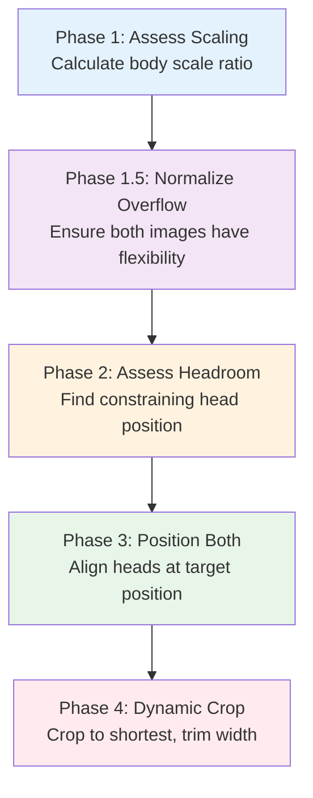
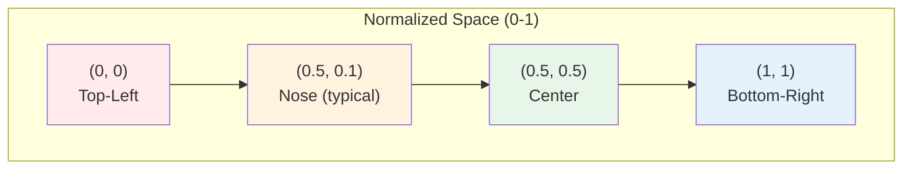
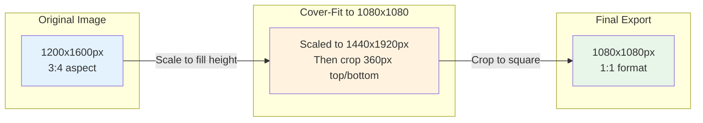
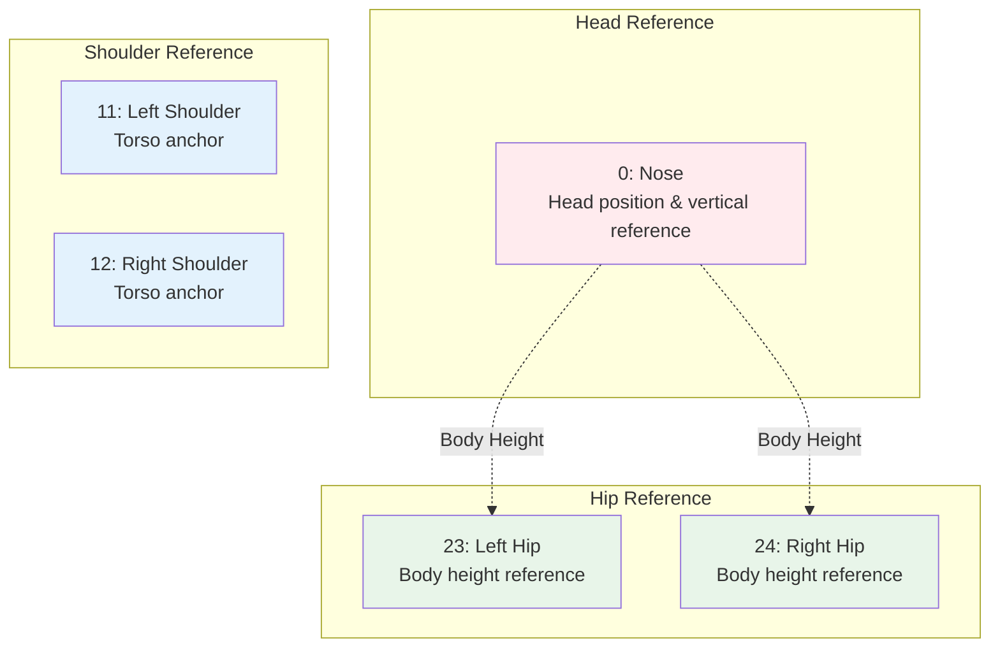
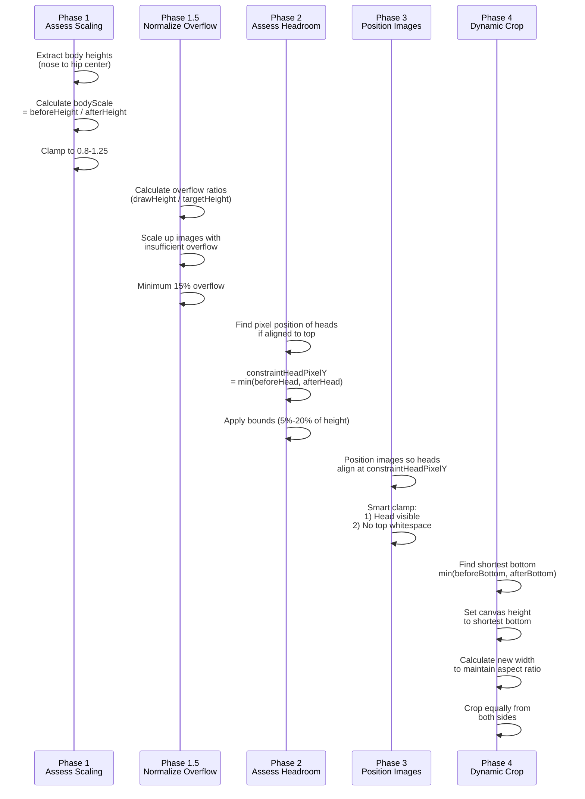
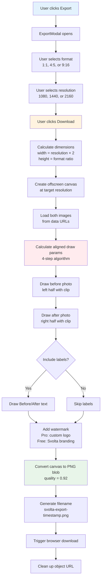

# Alignment & Export Algorithm

**Version:** 2.1.0
**Last Updated:** 2026-01-04
**Status:** Production

## Scope

This document describes the **core business logic** of Svolta: the 4-step alignment algorithm that enables professional before/after photo comparisons. This algorithm transforms pose-detected landmark data into precisely aligned, cropped, and scaled export images.

**Key Files:**

- `/lib/canvas/export.ts` - Export algorithm implementation
- `/lib/canvas/aligned-draw-params.ts` - Shared alignment calculation (used by export, GIF, and preview)
- `/lib/canvas/alignment.ts` - Alignment calculation utilities
- `/lib/debug/alignment-logger.ts` - Debug logging utility for alignment exports
- `/components/features/editor/ExportModal.tsx` - Export UI

**Critical Importance:** This algorithm is the foundation of Svolta's value proposition. Understanding it is essential for:

- Debugging alignment issues
- Adding new export formats
- Implementing alignment previews
- Supporting manual alignment overrides

---

## Table of Contents

1. [Algorithm Overview](#algorithm-overview)
2. [Coordinate Systems](#coordinate-systems)
3. [MediaPipe Landmarks](#mediapipe-landmarks)
4. [4-Step Alignment Algorithm](#4-step-alignment-algorithm)
5. [Export Pipeline](#export-pipeline)
6. [Format Specifications](#format-specifications)
7. [Mathematical Examples](#mathematical-examples)
8. [Edge Cases & Limitations](#edge-cases--limitations)
9. [Debugging Guide](#debugging-guide)
10. [Code References](#code-references)

---

## Algorithm Overview

Svolta's alignment algorithm ensures that before/after photos are aligned by **head position** and scaled to match **body heights**, creating professional side-by-side comparisons.

**Four-Phase Design Philosophy:**



**Key Insights:**

1. Calculate **actual pixel positions after scaling**, ensuring both images can satisfy alignment constraints
2. **Dynamic canvas dimensions**: Canvas size adjusts based on where both images end, not a fixed target
3. **Crop to shortest image**: No white space at bottom, then trim width to maintain aspect ratio
4. **Equal side cropping**: Width is trimmed equally from both sides to keep subjects centered

---

## Coordinate Systems

Understanding the two coordinate systems is critical:

### 1. Normalized Coordinates (MediaPipe)

MediaPipe returns landmarks in **normalized coordinates** where:

- Origin (0, 0) = top-left corner
- (1, 1) = bottom-right corner
- Resolution-independent (same values for 100x100 or 4000x4000 image)



**Example:**

```typescript
// MediaPipe returns:
{
  x: 0.512,  // 51.2% from left edge
  y: 0.089,  // 8.9% from top edge
  z: -0.23,  // depth (not used for 2D alignment)
  visibility: 0.98  // 98% confidence
}
```

### 2. Pixel Coordinates (Export Canvas)

Export uses **pixel coordinates** with cover-fit cropping:



**Cover-Fit Logic:**

```typescript
function calculateCoverFit(
  imgWidth: number,
  imgHeight: number,
  targetWidth: number,
  targetHeight: number,
): { drawX: number; drawY: number; drawWidth: number; drawHeight: number } {
  const imgAspect = imgWidth / imgHeight;
  const targetAspect = targetWidth / targetHeight;

  let drawWidth: number;
  let drawHeight: number;
  let drawX: number;
  let drawY: number;

  if (imgAspect > targetAspect) {
    // Image is WIDER - fit to height, crop sides
    drawHeight = targetHeight;
    drawWidth = targetHeight * imgAspect;
    drawX = (targetWidth - drawWidth) / 2; // center horizontally
    drawY = 0;
  } else {
    // Image is TALLER - fit to width, crop top/bottom
    drawWidth = targetWidth;
    drawHeight = targetWidth / imgAspect;
    drawX = 0;
    drawY = (targetHeight - drawHeight) / 2; // center vertically
  }

  return { drawX, drawY, drawWidth, drawHeight };
}
```

---

## MediaPipe Landmarks

MediaPipe Pose detection provides 33 body landmarks. Svolta uses these key landmarks:



**Landmark Structure:**

```typescript
interface Landmark {
  x: number; // Normalized X (0-1)
  y: number; // Normalized Y (0-1)
  z: number; // Depth (unused in 2D)
  visibility: number; // Confidence (0-1)
}

const VISIBILITY_THRESHOLD = 0.5; // Minimum confidence to use landmark
```

**Body Height Calculation:**

```typescript
function getBodyHeight(landmarks: Landmark[] | undefined): number {
  if (!landmarks || landmarks.length < 33) return 0.5;

  const nose = landmarks[0];
  const leftHip = landmarks[23];
  const rightHip = landmarks[24];

  // Check visibility
  const hasNose = (nose?.visibility ?? 0) >= 0.5;
  const hasLeftHip = (leftHip?.visibility ?? 0) >= 0.5;
  const hasRightHip = (rightHip?.visibility ?? 0) >= 0.5;

  if (!hasNose) return 0.5;

  // Calculate hip center
  let hipY: number;
  if (hasLeftHip && hasRightHip) {
    hipY = (leftHip.y + rightHip.y) / 2;
  } else if (hasLeftHip) {
    hipY = leftHip.y;
  } else if (hasRightHip) {
    hipY = rightHip.y;
  } else {
    return 0.5;
  }

  return Math.abs(hipY - nose.y); // Normalized body height
}
```

---

## 4-Step Alignment Algorithm

The alignment algorithm has **four phases** that ensure both images can satisfy alignment constraints with no white space.



### Phase 1: Assess Scaling Required

**Goal:** Calculate how much to scale the "after" image to match body heights.

**Formula:**

```
bodyScale = beforeBodyHeight / afterBodyHeight
bodyScale_clamped = max(0.8, min(1.25, bodyScale))
```

**Implementation:**

```typescript
// Get normalized body heights (0-1 range)
const beforeBodyH = getBodyHeight(beforeLandmarks); // e.g., 0.45 (45% of image)
const afterBodyH = getBodyHeight(afterLandmarks); // e.g., 0.60 (60% of image)

// Calculate scale: make after body match before body height
let bodyScale = afterBodyH > 0 ? beforeBodyH / afterBodyH : 1;
// 0.45 / 0.60 = 0.75 (zoom out the after image)

// Clamp to reasonable range (0.8-1.25 for natural results)
bodyScale = Math.max(0.8, Math.min(1.25, bodyScale));
// 0.75 clamped to 0.8
```

**Why clamp to 0.8-1.25?**

- Prevents extreme scaling that looks unnatural
- Handles cases where pose detection misjudges body height
- Maintains visual consistency

### Phase 1.5: Normalize Overflow Between Images

**Goal:** Ensure both images have similar flexibility for alignment by scaling up images with insufficient overflow.

**Problem Solved:** When a square image is exported to square format, it has no overflow (exact fit), while a portrait image has plenty. This caused alignment issues because only one image had room to move.

**Implementation:**

```typescript
// Calculate how much each image overflows the target
const beforeOverflow = beforeFit.drawHeight / targetHeight;
const afterOverflow = afterFit.drawHeight / targetHeight;

// Target overflow is the max of both, with minimum 15%
const targetOverflow = Math.max(beforeOverflow, afterOverflow, 1.15);

// Scale up images that have less overflow
let beforeScale = 1;
let afterScale = 1;

if (beforeOverflow < targetOverflow) {
  beforeScale = targetOverflow / beforeOverflow;
}
if (afterOverflow < targetOverflow) {
  afterScale = targetOverflow / afterOverflow;
}

// Apply overflow normalization
const beforeScaledWidth = beforeFit.drawWidth * beforeScale;
const beforeScaledHeight = beforeFit.drawHeight * beforeScale;

// After image also gets body scale applied
const afterScaledWidth = afterFit.drawWidth * afterScale * bodyScale;
const afterScaledHeight = afterFit.drawHeight * afterScale * bodyScale;
```

**Example:**

```
Square before: 1080x1080 (overflow = 1.0)
Portrait after: 1080x1440 (overflow = 1.33)

targetOverflow = max(1.0, 1.33, 1.15) = 1.33
beforeScale = 1.33 / 1.0 = 1.33
afterScale = 1 (already at target)

Result: Square image scaled to 1436x1436, now has flexibility for alignment
```

### Phase 2: Assess Headroom Constraint

**Goal:** Find the head position that **both images** can satisfy given their scaled dimensions.

**Key Insight:** The image with **less headroom available** (smaller head pixel position when aligned to top) becomes the constraint that both images must satisfy.

**Steps:**

1. **Calculate cover-fit dimensions at final scales:**

```typescript
const beforeFit = calculateCoverFit(
  beforeImg.width,
  beforeImg.height,
  targetWidth, // e.g., 1080px
  targetHeight, // e.g., 1080px
);
// Returns: { drawX, drawY, drawWidth, drawHeight }
// e.g., { drawX: 0, drawY: -120, drawWidth: 1080, drawHeight: 1320 }

const afterFit = calculateCoverFit(
  afterImg.width,
  afterImg.height,
  targetWidth,
  targetHeight,
);
```

2. **Apply overflow normalization and body scale:**

```typescript
// From Phase 1.5
const beforeScaledWidth = beforeFit.drawWidth * beforeScale;
const beforeScaledHeight = beforeFit.drawHeight * beforeScale;
const afterScaledWidth = afterFit.drawWidth * afterScale * bodyScale;
const afterScaledHeight = afterFit.drawHeight * afterScale * bodyScale;
```

3. **Calculate pixel position of heads if aligned to top (drawY = 0):**

```typescript
const beforeHeadAtTop = beforeHeadY * beforeFit.drawHeight;
// beforeHeadY = 0.10 (normalized), drawHeight = 1320px
// beforeHeadAtTop = 0.10 * 1320 = 132px

const afterHeadAtTop = afterHeadY * afterScaledHeight;
// afterHeadY = 0.15, afterScaledHeight = 1100px
// afterHeadAtTop = 0.15 * 1100 = 165px
```

4. **Find constraint (image with LEAST headroom):**

```typescript
const constraintHeadPixelY = Math.min(beforeHeadAtTop, afterHeadAtTop);
// min(132, 165) = 132px
```

5. **Apply min/max bounds:**

```typescript
const minHeadY = targetHeight * 0.05; // 5% from top = 54px
const maxHeadY = targetHeight * 0.2; // 20% from top = 216px

const targetHeadPixelY = Math.max(
  minHeadY,
  Math.min(maxHeadY, constraintHeadPixelY),
);
// max(54, min(216, 132)) = 132px (within bounds)
```

**Why use pixel positions instead of normalized?**

- Different scaled heights mean same normalized Y represents different pixel distances
- Example: 0.10 normalized = 132px in before (1320px tall) but 110px in after (1100px tall)
- Must calculate in pixels to find true constraint

### Phase 3: Position Both Images

**Goal:** Position images so heads align at `targetHeadPixelY` while minimizing whitespace.

**Formula:**

```
drawY = targetHeadPixelY - headPixelAtTop
```

**Implementation:**

```typescript
// Calculate drawY to align heads
let beforeDrawY = targetHeadPixelY - beforeHeadAtTop;
// 132 - 132 = 0 (no adjustment needed)

let afterDrawY = targetHeadPixelY - afterHeadAtTop;
// 132 - 165 = -33 (shift up 33px)

// Apply smart clamping
beforeDrawY = clampForHeadVisibility(
  beforeDrawY,
  beforeFit.drawHeight,
  targetHeight,
  beforeHeadY,
);

afterDrawY = clampForHeadVisibility(
  afterDrawY,
  afterScaledHeight,
  targetHeight,
  afterHeadY,
);
```

**Smart Clamp Priority (in order):**

1. **Head must be visible** (at least 5% from top):

```typescript
const headPixelInImage = headY * drawHeight;
const headPixelOnCanvas = drawY + headPixelInImage;
const minHeadOnCanvas = targetHeight * 0.05;

if (headPixelOnCanvas < minHeadOnCanvas) {
  drawY = minHeadOnCanvas - headPixelInImage;
}
```

2. **No whitespace at top** (drawY ≤ 0):

```typescript
drawY = Math.min(0, drawY);
```

**Note:** Bottom whitespace is handled in Phase 4 by dynamically cropping the canvas to the shortest image, so no bottom clamp is needed here.

**Result:**

```typescript
return {
  before: {
    drawX: beforeDrawX,
    drawY: beforeDrawY,
    drawWidth: beforeFit.drawWidth,
    drawHeight: beforeFit.drawHeight,
  },
  after: {
    drawX: afterDrawX,
    drawY: afterDrawY,
    drawWidth: afterScaledWidth,
    drawHeight: afterScaledHeight,
  },
};
```

### Phase 4: Dynamic Crop to Eliminate White Space

**Goal:** Crop the canvas to eliminate any white space at the bottom while maintaining the target aspect ratio.

**Problem Solved:** When two images have different heights or alignment positions, one may end higher than the other, leaving white space at the bottom of one panel.

**Algorithm:**

1. **Find where each image ends (bottom edge):**

```typescript
const beforeBottom = alignParams.before.drawY + alignParams.before.drawHeight;
const afterBottom = alignParams.after.drawY + alignParams.after.drawHeight;
```

2. **Crop to shortest bottom (don't exceed target height):**

```typescript
const visibleHeight = Math.round(
  Math.min(beforeBottom, afterBottom, targetHeight),
);
```

3. **Calculate new width to maintain aspect ratio:**

```typescript
const aspectRatio = getAspectRatio(format); // 1.0, 0.8, or 0.5625
const finalHalfWidth = Math.round(visibleHeight * aspectRatio);
const finalWidth = finalHalfWidth * 2;
```

4. **Crop equally from both sides:**

```typescript
const widthTrimPerSide = (targetHalfWidth - finalHalfWidth) / 2;

// Adjust draw params to account for trimmed width
const beforeAdjustedParams = {
  ...alignParams.before,
  drawX: alignParams.before.drawX - widthTrimPerSide,
};
const afterAdjustedParams = {
  ...alignParams.after,
  drawX: alignParams.after.drawX - widthTrimPerSide,
};
```

**Example:**

```
Before: drawY = -151px, height = 1552px → bottom = 1401px
After:  drawY = -104px, height = 1390px → bottom = 1286px

Crop line = min(1401, 1286, 1350) = 1286px
Visible height = 1286px

For 4:5 ratio (0.8 aspect):
  finalHalfWidth = 1286 * 0.8 = 1029px
  finalWidth = 2058px

Width trim per side = (1080 - 1029) / 2 = 25.5px

Result: Final canvas = 2058 × 1286 (instead of 2160 × 1350)
```

**Benefits:**

- ✓ Heads remain aligned (Phase 3 positioning unchanged)
- ✓ No white space at bottom
- ✓ Correct aspect ratio maintained
- ✓ Equal cropping from both sides keeps subjects centered

---

## Export Pipeline

The complete export process from user click to downloaded image:



**Code Reference:**

```typescript
export async function exportCanvas(
  beforePhoto: {
    dataUrl: string;
    width: number;
    height: number;
    landmarks?: Landmark[];
  },
  afterPhoto: {
    dataUrl: string;
    width: number;
    height: number;
    landmarks?: Landmark[];
  },
  _anchor: "head" | "shoulders" | "hips" | "full",
  options: ExportOptions,
): Promise<ExportResult>;
```

---

## Format Specifications

Svolta supports three export formats optimized for social media:

| Format   | Ratio    | Resolution Options | Dimensions (1080) | Use Case                 |
| -------- | -------- | ------------------ | ----------------- | ------------------------ |
| **1:1**  | Square   | 1080, 1440, 2160   | 2160 × 1080       | Instagram posts          |
| **4:5**  | Portrait | 1080, 1440, 2160   | 2160 × 1350       | Instagram portrait       |
| **9:16** | Stories  | 1080, 1440, 2160   | 2160 × 1920       | Instagram Stories, Reels |

**Dimension Calculation:**

```typescript
function calculateDimensions(
  format: ExportFormat,
  resolution: ExportResolution,
): { width: number; height: number; halfWidth: number } {
  const width = resolution * 2; // Double for side-by-side
  let height: number;

  switch (format) {
    case "1:1":
      height = resolution;
      break;
    case "4:5":
      height = Math.round(resolution * 1.25);
      break;
    case "9:16":
      height = Math.round((resolution * 16) / 9);
      break;
  }

  return { width, height, halfWidth: resolution };
}
```

**Example Output Sizes:**

| Format | 1080        | 1440        | 2160        |
| ------ | ----------- | ----------- | ----------- |
| 1:1    | 2160 × 1080 | 2880 × 1440 | 4320 × 2160 |
| 4:5    | 2160 × 1350 | 2880 × 1800 | 4320 × 2700 |
| 9:16   | 2160 × 1920 | 2880 × 2560 | 4320 × 3840 |

---

## Mathematical Examples

### Example 1: Standard Alignment (Front Poses)

**Input:**

- Before image: 1200 × 1600px (3:4 aspect), head at Y=0.10, body height=0.45
- After image: 1600 × 1200px (4:3 aspect), head at Y=0.15, body height=0.60
- Target: 1080 × 1080px (1:1 format)

**Phase 1: Calculate Body Scale**

```
bodyScale = beforeBodyHeight / afterBodyHeight
bodyScale = 0.45 / 0.60 = 0.75

Clamped: max(0.8, min(1.25, 0.75)) = 0.8
```

**Phase 2: Calculate Cover-Fit Dimensions**

Before image (3:4 aspect to 1:1):

```
imgAspect = 1200 / 1600 = 0.75
targetAspect = 1080 / 1080 = 1.0

imgAspect < targetAspect → Image is TALLER
drawWidth = 1080
drawHeight = 1080 / 0.75 = 1440
drawX = 0
drawY = (1080 - 1440) / 2 = -180
```

After image (4:3 aspect to 1:1):

```
imgAspect = 1600 / 1200 = 1.33
targetAspect = 1.0

imgAspect > targetAspect → Image is WIDER
drawHeight = 1080
drawWidth = 1080 * 1.33 = 1439
drawX = (1080 - 1439) / 2 = -179.5
drawY = 0

Apply body scale (0.8):
afterScaledWidth = 1439 * 0.8 = 1151
afterScaledHeight = 1080 * 0.8 = 864
```

**Phase 2: Calculate Head Pixel Positions**

```
beforeHeadAtTop = 0.10 * 1440 = 144px
afterHeadAtTop = 0.15 * 864 = 129.6px

constraintHeadPixelY = min(144, 129.6) = 129.6px

Bounds check:
minHeadY = 1080 * 0.05 = 54px
maxHeadY = 1080 * 0.20 = 216px

targetHeadPixelY = max(54, min(216, 129.6)) = 129.6px
```

**Phase 3: Calculate Draw Y Positions**

```
beforeDrawY = 129.6 - 144 = -14.4px
afterDrawY = 129.6 - 129.6 = 0px

After clamping:
beforeDrawY = -14.4px (within bounds)
afterDrawY = 0px (within bounds)
```

**Final Result:**

- Before image: drawn at (0, -14.4) with size 1080 × 1440
- After image: drawn at (0, 0) with size 1151 × 864 (scaled)
- Both heads aligned at 129.6px from top

### Example 2: Extreme Height Difference

**Input:**

- Before: head at Y=0.08, body height=0.50
- After: head at Y=0.20, body height=0.30
- Target: 1080 × 1080px

**Phase 1:**

```
bodyScale = 0.50 / 0.30 = 1.67
Clamped: max(0.8, min(1.25, 1.67)) = 1.25
```

After image scaled UP by 1.25x to match body height.

**Result:** The clamp prevents excessive scaling while still improving alignment.

---

## Edge Cases & Limitations

### 1. Insufficient Landmark Visibility

**Problem:** MediaPipe fails to detect key landmarks (nose, hips).

**Fallback Behavior:**

```typescript
if (!beforeNose || beforeNose.visibility < 0.5) {
  beforeHeadY = 0.1; // Assume head near top
}

if (!hasAnyHips) {
  return 0.5; // Default body height
}
```

**Impact:** Falls back to reasonable defaults but alignment may be less accurate.

### 2. Side Profile Poses

**Problem:** 90° profile poses often have low landmark visibility.

**Detection Strategy:**

```typescript
// Try multiple strategies in order:
1. Both hips visible → use hip center
2. Left hip visible → use left hip only
3. Right hip visible → use right hip only
4. No hips → default to 0.5
```

**Impact:** Single hip alignment is less accurate than hip center but better than no alignment.

### 3. Very Different Aspect Ratios

**Problem:** Before is portrait (3:4), After is landscape (16:9).

**Consequence:**

- Cover-fit crops very differently
- One image may have significant top/bottom cropping
- Other image may have significant left/right cropping
- Alignment works but more of the image is lost

**Recommendation:** Encourage users to capture photos in similar aspect ratios.

### 4. Extreme Body Size Changes

**Problem:** Significant weight loss/gain exceeds 0.8-1.25 scale clamp.

**Example:**

- Before: body height = 0.40 (larger person, further from camera)
- After: body height = 0.65 (smaller person, closer to camera)
- bodyScale = 0.40 / 0.65 = 0.615
- Clamped to 0.8

**Impact:** Bodies won't perfectly match height but prevents grotesque scaling.

**Future Enhancement:** Could add "extreme transformation mode" with wider clamp (0.5-2.0).

### 5. Poor Photo Framing

**Problem:** Subject's head or hips cut off in frame.

**Impact:**

- Landmark detection fails or has low visibility
- Falls back to defaults
- Alignment degrades to simple centering

**Recommendation:** Photo capture guidance UI showing ideal framing.

### 6. Different Lighting/Background

**Not a limitation:** Alignment algorithm is unaffected by:

- Background changes
- Lighting differences
- Clothing changes
- Time of day

Only depends on pose landmarks.

---

## Debugging Guide

### Debug Logging System

Svolta includes a toggleable debug logging system that writes alignment data to both the browser console and a file for easy analysis.

#### Enabling Debug Logging

```javascript
// In browser console:
window.svoltaDebug.enable(); // Enable debug logging
window.svoltaDebug.disable(); // Disable debug logging
window.svoltaDebug.isEnabled(); // Check status

// Or via localStorage:
localStorage.setItem("svolta_debug_alignment", "true");

// Or via environment variable in .env.local:
NEXT_PUBLIC_DEBUG_ALIGNMENT = true;
```

#### Log File Output

When enabled, alignment data is written to `debug/alignment-log.json` (development only):

```json
[
  {
    "timestamp": "2026-01-04T10:30:45.123Z",
    "input": {
      "beforeImg": { "width": 1536, "height": 2048 },
      "afterImg": { "width": 1536, "height": 2048 },
      "targetWidth": 1080,
      "targetHeight": 1350,
      "beforeLandmarks": {
        "count": 33,
        "nose": { "y": 0.2328, "visibility": 0.9999 },
        "leftShoulder": { "x": 0.5709, "y": 0.3136, "visibility": 0.9999 },
        "rightShoulder": { "x": 0.3756, "y": 0.3195, "visibility": 0.9999 },
        "leftHip": { "y": 0.5213, "visibility": 0.9997 },
        "rightHip": { "y": 0.5272, "visibility": 0.9997 }
      },
      "afterLandmarks": { ... }
    },
    "result": {
      "before": { "drawX": -11.13, "drawY": -91.5, "drawWidth": 1164.38, "drawHeight": 1552.5 },
      "after": { "drawX": -308.51, "drawY": -556.28, "drawWidth": 1719.89, "drawHeight": 2293.19 },
      "useShoulderAlignment": false,
      "cropTopOffset": 0
    },
    "metadata": { "source": "png" }
  }
]
```

#### Debug API Endpoints

| Method | Endpoint                   | Description          |
| ------ | -------------------------- | -------------------- |
| GET    | `/api/debug/alignment-log` | Read all log entries |
| POST   | `/api/debug/alignment-log` | Append new log entry |
| DELETE | `/api/debug/alignment-log` | Clear the log file   |

**Note:** Debug endpoints only work in development mode (`NODE_ENV=development`).

### Legacy Console Logs

The export function also logs detailed information to help diagnose alignment issues:

```typescript
console.log("[Phase1] Body heights:", {
  beforeBodyH: 0.45,
  afterBodyH: 0.6,
  bodyScale: 0.8,
});

console.log("[Phase2] Head positions if aligned to top:", {
  beforeHeadAtTop: 144,
  afterHeadAtTop: 129.6,
});

console.log("[Phase2] Head constraint:", {
  constraintHeadPixelY: 129.6,
  minHeadY: 54,
  maxHeadY: 216,
  targetHeadPixelY: 129.6,
});

console.log("[Phase3] Final positions:", {
  before: { drawX: 0, drawY: -14.4, drawWidth: 1080, drawHeight: 1440 },
  after: { drawX: 0, drawY: 0, drawWidth: 1151, drawHeight: 864 },
});
```

### Debugging Checklist

**Issue: Heads not aligned**

1. Check landmark visibility:

```typescript
console.log("Before nose visibility:", beforeLandmarks[0]?.visibility);
console.log("After nose visibility:", afterLandmarks[0]?.visibility);
// Should be ≥ 0.5
```

2. Check head Y positions:

```typescript
console.log("Before head Y (normalized):", beforeLandmarks[0]?.y);
console.log("After head Y (normalized):", afterLandmarks[0]?.y);
// Should be 0.05 - 0.25 typically
```

3. Check phase 2 constraint calculation:

```typescript
// Is constraintHeadPixelY being clamped?
// If yes, one image doesn't have enough headroom
```

**Issue: Bodies not matching height**

1. Check body heights:

```typescript
console.log("Before body height:", getBodyHeight(beforeLandmarks));
console.log("After body height:", getBodyHeight(afterLandmarks));
// Should be 0.3 - 0.6 typically
```

2. Check body scale:

```typescript
console.log("Calculated bodyScale:", rawScale);
console.log("Clamped bodyScale:", clampedScale);
// If clamped, body heights won't perfectly match
```

3. Check hip visibility:

```typescript
console.log("Before hips:", {
  left: beforeLandmarks[23]?.visibility,
  right: beforeLandmarks[24]?.visibility,
});
// At least one should be ≥ 0.5
```

**Issue: Images too zoomed/cropped**

1. Check cover-fit dimensions:

```typescript
console.log("Before draw dimensions:", beforeFit);
console.log("After draw dimensions:", afterFit);
// drawHeight >> targetHeight means significant cropping
```

2. Check aspect ratio mismatch:

```typescript
const beforeAspect = beforeImg.width / beforeImg.height;
const afterAspect = afterImg.width / afterImg.height;
const targetAspect = targetWidth / targetHeight;
console.log("Aspect ratios:", { beforeAspect, afterAspect, targetAspect });
// Large differences = more cropping
```

### Debug Visualization

To visualize alignment, you can temporarily draw guides on the canvas:

```typescript
// Add after drawing photos, before watermark
ctx.strokeStyle = "red";
ctx.lineWidth = 2;

// Draw target head line (where heads should align)
ctx.beginPath();
ctx.moveTo(0, targetHeadPixelY);
ctx.lineTo(width, targetHeadPixelY);
ctx.stroke();

// Draw 5% and 20% bounds
ctx.strokeStyle = "yellow";
ctx.beginPath();
ctx.moveTo(0, minHeadY);
ctx.lineTo(width, minHeadY);
ctx.stroke();

ctx.beginPath();
ctx.moveTo(0, maxHeadY);
ctx.lineTo(width, maxHeadY);
ctx.stroke();
```

---

## Code References

### Primary Files

**`/lib/canvas/aligned-draw-params.ts`** - Shared alignment algorithm

- `calculateCoverFit` - Cover-fit calculation
- `getBodyHeight` - Extract body height from landmarks
- `calculateAlignedDrawParams` - **THE CORE ALGORITHM** (Phases 1, 1.5, 2, 3)
- Used by PNG export, GIF export, and preview components

**`/lib/canvas/export.ts`** - PNG export with debug wrapper

- `loadImage` - Utility to load images from data URLs
- `calculateDimensions` - Calculate target dimensions for format
- `getAspectRatio` - Helper for Phase 4 dynamic crop
- `calculateAlignedDrawParamsWithDebug` - Debug wrapper that calls shared algorithm
- `drawPhotoWithParams` - Canvas drawing utility
- `drawLabels` - Text rendering for Before/After labels
- `exportCanvas` - Main export function (includes Phase 4 dynamic crop)
- `triggerDownload` - Browser download helper

**`/lib/debug/alignment-logger.ts`** - Debug logging utility

- `isAlignmentDebugEnabled()` - Check if debug is enabled
- `setAlignmentDebug(enabled)` - Enable/disable debug mode
- `buildLogEntry()` - Create structured log entries
- `logAlignment()` - Log to console and file API
- `extractLandmarkSummary()` - Extract key landmarks for logging
- `window.svoltaDebug` - Browser console helper object

**`/lib/canvas/alignment.ts`**

- Lines 12-26: Type definitions (`AlignmentResult`, `AnchorType`)
- Lines 28-37: Anchor landmark indices mapping
- Lines 58-83: `calculateNormalizedCenter` for anchor points
- Lines 85-156: `calculateNormalizedScaleReference` with multiple strategies
- Lines 158-237: `calculateAlignment` - **PREVIEW ALIGNMENT** (different from export)
- Lines 239-257: `canCalculateAlignment` validation
- Lines 259-272: `getAnchorDescription` UI helper

**`/components/features/editor/ExportModal.tsx`**

- Lines 30-60: Export format selection UI
- Lines 62-95: Export resolution selection UI
- Lines 97-125: Export options (labels, watermark)
- Lines 127-165: Export button and download trigger
- Lines 167-200: Loading states and error handling

### Related Files

**`/lib/canvas/watermark.ts`**

- Watermark rendering logic (Pro vs Free tier)

**`/components/features/editor/PhotoPanel.tsx`**

- Preview alignment using CSS transforms
- Uses `alignment.ts` for preview (different coordinate system)

**`/hooks/useAlignment.ts`**

- React hook for alignment state management

**`/types/landmarks.ts`**

- MediaPipe landmark type definitions
- `VISIBILITY_THRESHOLD = 0.5`

---

## Future Enhancements

### 1. Alignment Preview in Export Modal

Show side-by-side preview before download with target format applied.

**Implementation:**

- Render small preview canvas (540 × 540) using same algorithm
- Update preview on format change
- Allow users to see final result before downloading

### 2. Manual Alignment Overrides

Allow users to manually adjust alignment when pose detection fails.

**UI Concept:**

- Sliders for scale, offsetX, offsetY
- Reset button to return to auto-alignment
- Real-time preview of adjustments

### 3. Alignment Confidence Score

Display confidence score based on landmark visibility.

**Calculation:**

```typescript
const confidenceScore =
  (beforeNoseVisibility +
    afterNoseVisibility +
    beforeHipAvgVisibility +
    afterHipAvgVisibility) /
  4;

if (confidenceScore < 0.6) {
  showWarning("Low alignment confidence. Consider retaking photos.");
}
```

### 4. Guided Photo Capture

Show outline overlay during photo capture to help users frame properly.

**Features:**

- Head position guide (top 10% of frame)
- Full body guide (head to knees visible)
- Aspect ratio guide (match format selection)

### 5. Export Format Presets

Save user's preferred export settings.

**Storage:**

```typescript
interface ExportPreset {
  format: ExportFormat;
  resolution: ExportResolution;
  includeLabels: boolean;
  quality: number;
}
```

### 6. Batch Export

Export multiple before/after pairs at once.

**Use Case:** Coaches with multiple clients.

---

## Summary

The Svolta alignment algorithm is a **four-phase, pixel-space calculation** that ensures professional before/after photo alignment with no white space:

1. **Phase 1:** Calculate body scale to match heights (0.8-1.25 clamp)
2. **Phase 1.5:** Normalize overflow to ensure both images have alignment flexibility
3. **Phase 2:** Find head position constraint that both images can satisfy
4. **Phase 3:** Position images with smart clamping for head visibility
5. **Phase 4:** Dynamically crop canvas to eliminate white space while maintaining aspect ratio

**Key Principles:**

- Calculate in pixel space (not normalized) after cover-fit
- Normalize overflow so both images have similar flexibility for alignment
- Use the image with LEAST headroom as the constraint
- Prioritize head visibility over perfect body alignment
- Clamp scale to 0.8-1.25 for natural results
- Crop to shortest image's bottom, then trim width to maintain aspect ratio
- Crop equally from both sides to keep subjects centered
- Handle edge cases gracefully with fallback strategies

This algorithm is the **foundation of Svolta's value proposition** and must be maintained with extreme care. Any modifications should be tested extensively with diverse photo types, aspect ratios, and body types.

---

**Related Documentation:**

- [Pose Detection](./pose-detection.md) - MediaPipe integration and landmark reference
- [Architecture Overview](../architecture/overview.md) - System design and data flow
- [Testing Standards](../standards/testing.md) - Visual regression testing for alignment validation

---

## Testing the Alignment Algorithm

The alignment algorithm is protected by a comprehensive visual regression testing suite. Any changes to the algorithm should pass all tests before merging.

### Running Tests

```bash
# Run all alignment tests (unit + visual)
npm run test:visual

# Run only unit tests (faster feedback during development)
npm run test:visual:unit

# Open HTML report to review results
npm run test:visual:report
```

### Test Coverage

**Unit Tests** (`tests/visual/alignment.unit.test.ts`):

- ~30 test cases covering all 4 phases of the algorithm
- Body scale calculation and clamping
- Overflow normalization
- Headroom constraints
- Image positioning
- Edge cases (low visibility, cropped heads, aspect ratios)

**Visual Regression Tests** (`tests/visual/alignment.visual.test.ts`):

- 24+ fixtures × 3 formats = 72+ pixel-level comparisons
- Pass criteria: ≥99.5% pixel match, ≤2px head delta
- Categories: Standard, Aspect, Extreme, Headroom, Low Visibility, Framing

### Updating After Algorithm Changes

1. Make algorithm changes
2. Run `npm run test:visual:unit` to verify logic
3. Run `npm run test:visual` to see visual impact
4. Review diff images in `tests/visual/diffs/`
5. If changes are intentional, regenerate baselines:
   ```bash
   npm run test:visual:generate
   npm run test:visual
   ```
6. Commit updated baselines with algorithm changes
