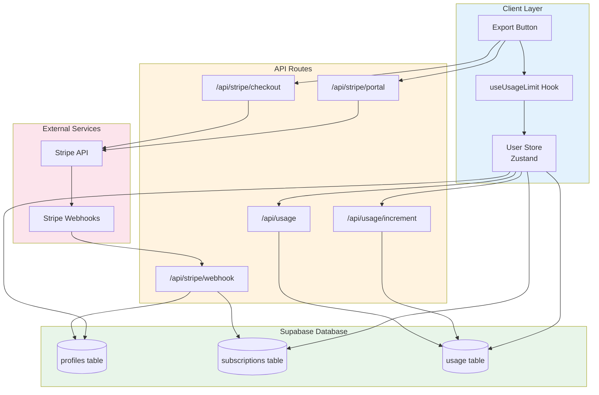
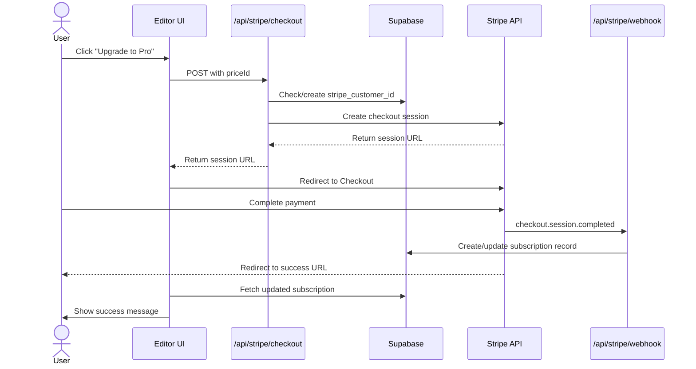
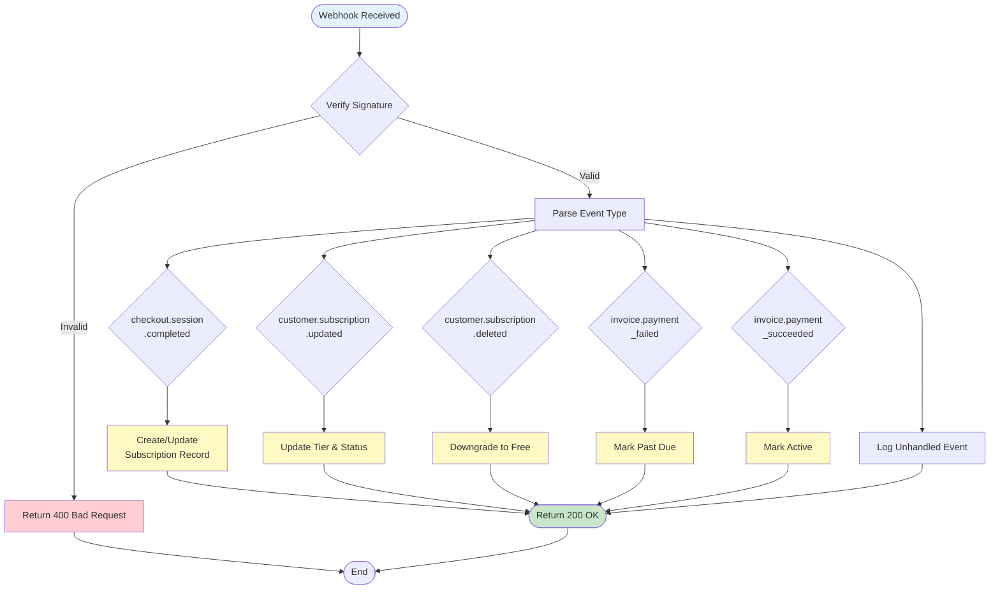
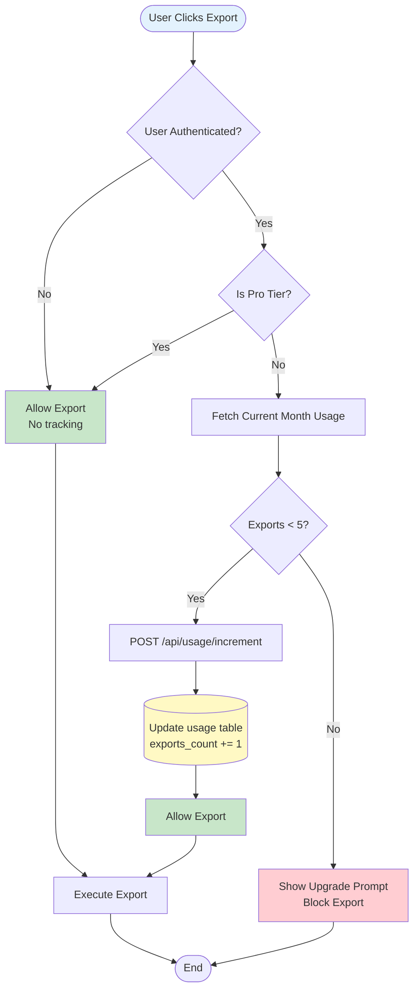

# Billing & Subscription System

**Version:** 1.0.0
**Last Updated:** 2025-12-22
**Scope:** Stripe integration, usage tracking, subscription lifecycle management

---

## Overview

PoseProof uses a freemium subscription model with Stripe for payment processing and Supabase for usage tracking. The system provides:

- **Free Tier:** 5 exports per month with PoseProof watermark
- **Pro Tier:** Unlimited exports, no watermark, custom branding (£9.99/month or £79/year)
- **Usage Tracking:** Monthly export counting with automatic reset
- **Webhook-Driven Sync:** Real-time subscription status updates via Stripe webhooks

**Key Technologies:**

- **Stripe Checkout:** Hosted payment pages for subscription creation
- **Stripe Customer Portal:** Self-service subscription management
- **Stripe Webhooks:** Event-driven subscription lifecycle updates
- **Supabase RLS:** Row-level security for usage data isolation
- **Zustand Store:** Client-side subscription state management

---

## Subscription Tiers

| Feature            | Free               | Pro                          |
| ------------------ | ------------------ | ---------------------------- |
| **Price**          | £0                 | £9.99/month or £79/year      |
| **Exports/Month**  | 5                  | Unlimited                    |
| **Watermark**      | PoseProof branding | No watermark                 |
| **Custom Logo**    | ❌                 | ✅                           |
| **Export Formats** | 1:1 only           | All formats (1:1, 4:5, 9:16) |
| **Support**        | Community          | Priority                     |

**Pricing Strategy:**

- Monthly billing: £9.99/month (£119.88/year)
- Annual billing: £79/year (34% savings)
- Promo codes: Enabled in checkout
- Team tier: Planned (£29.99/month for 5 seats)

**Feature Gating:**

- Free users see upgrade prompts at 3rd and 5th exports
- Pro users bypass all usage checks
- Anonymous users can export without limits (no tracking)

---

## Architecture

### System Components



### Database Schema

```sql
-- User profiles with Stripe customer ID
CREATE TABLE profiles (
  id UUID PRIMARY KEY REFERENCES auth.users(id),
  email TEXT NOT NULL,
  full_name TEXT,
  stripe_customer_id TEXT UNIQUE,
  created_at TIMESTAMPTZ DEFAULT NOW(),
  updated_at TIMESTAMPTZ DEFAULT NOW()
);

-- Subscription records (single active subscription per user)
CREATE TABLE subscriptions (
  id UUID PRIMARY KEY DEFAULT gen_random_uuid(),
  user_id UUID UNIQUE NOT NULL REFERENCES auth.users(id) ON DELETE CASCADE,
  stripe_subscription_id TEXT UNIQUE,
  stripe_customer_id TEXT,
  tier TEXT NOT NULL DEFAULT 'free' CHECK (tier IN ('free', 'pro', 'team')),
  status TEXT NOT NULL DEFAULT 'active' CHECK (status IN ('active', 'inactive', 'canceled', 'past_due', 'paused', 'incomplete')),
  current_period_end TIMESTAMPTZ,
  cancel_at_period_end BOOLEAN DEFAULT FALSE,
  created_at TIMESTAMPTZ DEFAULT NOW(),
  updated_at TIMESTAMPTZ DEFAULT NOW()
);

-- Monthly usage tracking
CREATE TABLE usage (
  id UUID PRIMARY KEY DEFAULT gen_random_uuid(),
  user_id UUID NOT NULL REFERENCES auth.users(id) ON DELETE CASCADE,
  month TEXT NOT NULL, -- Format: 'YYYY-MM'
  exports_count INTEGER NOT NULL DEFAULT 0,
  last_export_at TIMESTAMPTZ,
  created_at TIMESTAMPTZ DEFAULT NOW(),
  updated_at TIMESTAMPTZ DEFAULT NOW(),
  UNIQUE(user_id, month)
);

-- Indexes for performance
CREATE INDEX idx_subscriptions_user_id ON subscriptions(user_id);
CREATE INDEX idx_subscriptions_stripe_customer_id ON subscriptions(stripe_customer_id);
CREATE INDEX idx_usage_user_month ON usage(user_id, month);
```

---

## Stripe Integration

### Checkout Flow

**Sequence Diagram:**



**Implementation:**

```typescript
// app/api/stripe/checkout/route.ts
export async function POST(request: NextRequest) {
  // 1. Verify authentication
  const {
    data: { user },
  } = await supabase.auth.getUser();
  if (!user)
    return NextResponse.json({ error: "Unauthorized" }, { status: 401 });

  // 2. Parse priceId from request
  const { priceId } = await request.json();

  // 3. Get or create Stripe customer
  let customerId = profile?.stripe_customer_id;
  if (!customerId) {
    const customer = await getStripe().customers.create({
      email: user.email,
      metadata: { user_id: user.id },
    });
    customerId = customer.id;
    await supabase.from("profiles").update({ stripe_customer_id: customerId });
  }

  // 4. Create checkout session
  const session = await getStripe().checkout.sessions.create({
    customer: customerId,
    mode: "subscription",
    line_items: [{ price: priceId, quantity: 1 }],
    success_url: `${appUrl}/editor?upgrade=success`,
    cancel_url: `${appUrl}/upgrade?canceled=true`,
    metadata: { user_id: user.id },
    allow_promotion_codes: true,
  });

  return NextResponse.json({ url: session.url });
}
```

**Frontend Usage:**

```typescript
// components/UpgradeButton.tsx
const handleUpgrade = async () => {
  const priceId =
    billingPeriod === "monthly"
      ? PLANS.pro.stripePriceId
      : PLANS.pro.stripePriceIdYearly;

  const response = await fetch("/api/stripe/checkout", {
    method: "POST",
    headers: { "Content-Type": "application/json" },
    body: JSON.stringify({ priceId }),
  });

  const { url } = await response.json();
  window.location.href = url; // Redirect to Stripe Checkout
};
```

✅ **CORRECT:** Always pass `user_id` in metadata for webhook correlation

❌ **WRONG:** Relying on email matching alone (users can change emails)

---

### Customer Portal

**Purpose:** Allow users to self-manage subscriptions (update payment method, cancel, view invoices)

```typescript
// app/api/stripe/portal/route.ts
export async function POST() {
  const {
    data: { user },
  } = await supabase.auth.getUser();
  if (!user)
    return NextResponse.json({ error: "Unauthorized" }, { status: 401 });

  const { data: profile } = await supabase
    .from("profiles")
    .select("stripe_customer_id")
    .eq("id", user.id)
    .single();

  if (!profile?.stripe_customer_id) {
    return NextResponse.json(
      { error: "No active subscription found" },
      { status: 400 },
    );
  }

  const portalSession = await getStripe().billingPortal.sessions.create({
    customer: profile.stripe_customer_id,
    return_url: `${appUrl}/settings`,
  });

  return NextResponse.json({ url: portalSession.url });
}
```

**Frontend Usage:**

```typescript
// components/ManageSubscriptionButton.tsx
const handleManageSubscription = async () => {
  const response = await fetch("/api/stripe/portal", { method: "POST" });
  const { url } = await response.json();
  window.location.href = url;
};
```

✅ **CORRECT:** Use `return_url` to bring users back to your app

❌ **WRONG:** Not handling portal errors (user might not have subscription)

---

### Webhook Events

**Event Processing Flow:**



**Handled Events:**

| Event                           | Description                 | Action                                                             |
| ------------------------------- | --------------------------- | ------------------------------------------------------------------ |
| `checkout.session.completed`    | User completed checkout     | Create/update subscription record with tier=pro, status=active     |
| `customer.subscription.updated` | Subscription status changed | Update tier, status, period_end, cancel_at_period_end              |
| `customer.subscription.deleted` | Subscription canceled       | Downgrade to tier=free, status=canceled                            |
| `invoice.payment_failed`        | Payment failed              | Mark status=past_due (user retains access until retry period ends) |
| `invoice.payment_succeeded`     | Payment successful          | Ensure status=active                                               |

**Implementation:**

```typescript
// app/api/stripe/webhook/route.ts
export async function POST(request: NextRequest) {
  const body = await request.text();
  const signature = request.headers.get("stripe-signature");

  // Verify webhook signature
  const event = await constructWebhookEvent(body, signature);

  switch (event.type) {
    case "checkout.session.completed":
      await handleCheckoutCompleted(event.data.object);
      break;
    case "customer.subscription.updated":
      await handleSubscriptionUpdated(event.data.object);
      break;
    // ... other handlers
  }

  return NextResponse.json({ received: true });
}

async function handleCheckoutCompleted(session: Stripe.Checkout.Session) {
  const userId = session.metadata?.user_id;
  await getSupabaseAdmin().from("subscriptions").upsert(
    {
      user_id: userId,
      stripe_subscription_id: session.subscription,
      stripe_customer_id: session.customer,
      tier: "pro",
      status: "active",
      updated_at: new Date().toISOString(),
    },
    { onConflict: "user_id" },
  );
}
```

**Webhook Configuration:**

```bash
# Set up webhook endpoint in Stripe Dashboard
# URL: https://poseproof.com/api/stripe/webhook
# Events: checkout.session.completed, customer.subscription.*

# Test locally with Stripe CLI
stripe listen --forward-to localhost:3000/api/stripe/webhook

# Copy webhook signing secret to .env.local
STRIPE_WEBHOOK_SECRET=whsec_xxxxx
```

✅ **CORRECT:** Always verify webhook signatures before processing

❌ **WRONG:** Trusting webhook data without signature verification (security risk)

---

## Usage Tracking

### Monthly Export Counting

**Flow Diagram:**



### API Endpoints

**GET /api/usage**

Fetch current month's usage statistics.

**Request:**

```bash
curl -X GET https://poseproof.com/api/usage \
  -H "Authorization: Bearer <session_token>"
```

**Response:**

```json
{
  "exports_count": 3,
  "period_start": "2025-12-01",
  "limit": 5,
  "remaining": 2,
  "is_pro": false,
  "last_export_at": "2025-12-22T14:30:00Z"
}
```

**Pro User Response:**

```json
{
  "exports_count": 42,
  "period_start": "2025-12-01",
  "limit": -1, // -1 indicates unlimited
  "remaining": -1,
  "is_pro": true,
  "last_export_at": "2025-12-22T16:45:00Z"
}
```

---

**POST /api/usage/increment**

Increment export count and check limits.

**Request:**

```bash
curl -X POST https://poseproof.com/api/usage/increment \
  -H "Authorization: Bearer <session_token>"
```

**Success Response (under limit):**

```json
{
  "success": true,
  "exports_count": 4,
  "remaining": 1,
  "can_export": true,
  "limit_reached": false
}
```

**Error Response (limit reached):**

```json
{
  "error": "Export limit reached",
  "message": "You've reached your limit of 5 exports per month. Upgrade to Pro for unlimited exports.",
  "exports_count": 5,
  "remaining": 0,
  "can_export": false,
  "limit_reached": true
}
```

**Implementation:**

```typescript
// app/api/usage/increment/route.ts
export async function POST() {
  const {
    data: { user },
  } = await supabase.auth.getUser();
  if (!user)
    return NextResponse.json({ error: "Unauthorized" }, { status: 401 });

  const currentMonth = new Date().toISOString().slice(0, 7); // '2025-12'

  // Check if Pro
  const { data: subscription } = await supabase
    .from("subscriptions")
    .select("tier, status")
    .eq("user_id", user.id)
    .single();

  const isPro =
    subscription?.tier === "pro" && subscription?.status === "active";

  // Fetch current usage
  const { data: currentUsage } = await supabase
    .from("usage")
    .select("exports_count")
    .eq("user_id", user.id)
    .eq("month", currentMonth)
    .single();

  const currentCount = currentUsage?.exports_count ?? 0;

  // Check limit for free users
  if (!isPro && currentCount >= FREE_EXPORT_LIMIT) {
    return NextResponse.json(
      {
        error: "Export limit reached",
        exports_count: currentCount,
        remaining: 0,
        can_export: false,
        limit_reached: true,
      },
      { status: 403 },
    );
  }

  // Upsert usage record
  const { data: updatedUsage } = await supabase
    .from("usage")
    .upsert(
      {
        user_id: user.id,
        month: currentMonth,
        exports_count: currentCount + 1,
        last_export_at: new Date().toISOString(),
      },
      { onConflict: "user_id,month" },
    )
    .select()
    .single();

  return NextResponse.json({
    success: true,
    exports_count: updatedUsage.exports_count,
    remaining: isPro ? -1 : FREE_EXPORT_LIMIT - updatedUsage.exports_count,
    can_export: true,
    limit_reached: false,
  });
}
```

✅ **CORRECT:** Check limits before incrementing to prevent race conditions

❌ **WRONG:** Incrementing first then checking (allows over-limit exports)

---

### Frontend Integration

**User Store (Zustand):**

```typescript
// stores/user-store.ts
interface UserState {
  user: User | null;
  subscription: Subscription | null;
  usage: Usage | null;

  isPro: () => boolean;
  canExport: () => boolean;
  exportsRemaining: () => number;

  incrementUsage: () => Promise<{ success: boolean; remaining: number }>;
}

export const useUserStore = create<UserState>((set, get) => ({
  isPro: () => {
    const { subscription } = get();
    return subscription?.tier === "pro" && subscription?.status === "active";
  },

  canExport: () => {
    const { isPro, exportsRemaining } = get();
    if (isPro()) return true;
    return exportsRemaining() > 0;
  },

  exportsRemaining: () => {
    const { isPro, usage } = get();
    if (isPro()) return Infinity;
    const used = usage?.exports_count ?? 0;
    return Math.max(0, FREE_EXPORT_LIMIT - used);
  },

  incrementUsage: async () => {
    const response = await fetch("/api/usage/increment", { method: "POST" });
    const data = await response.json();

    if (data.success) {
      // Update local state
      await get().fetchUsage();
    }

    return { success: data.success, remaining: data.remaining };
  },
}));
```

**Usage Hook:**

```typescript
// hooks/useUsageLimit.ts
export function useUsageLimit() {
  const { usage, isPro, canExport, exportsRemaining, incrementUsage } =
    useUserStore();

  const checkAndIncrement = async (): Promise<boolean> => {
    // Allow anonymous users (no tracking)
    if (!user) return true;

    const result = await incrementUsage();
    return result.success;
  };

  return {
    used: usage?.exports_count ?? 0,
    limit: isPro() ? Infinity : FREE_EXPORT_LIMIT,
    remaining: exportsRemaining(),
    canExport: canExport(),
    isPro: isPro(),
    checkAndIncrement,
  };
}
```

**Export Component:**

```typescript
// components/ExportModal.tsx
const ExportModal = () => {
  const { canExport, remaining, checkAndIncrement } = useUsageLimit();

  const handleExport = async () => {
    // Check and increment usage
    const allowed = await checkAndIncrement();

    if (!allowed) {
      setShowUpgradePrompt(true);
      return;
    }

    // Proceed with export
    await exportCanvas();
  };

  return (
    <Modal>
      <Button onClick={handleExport} disabled={!canExport}>
        Export {!canExport && '(Limit Reached)'}
      </Button>
      {remaining < Infinity && (
        <p className="text-sm text-muted-foreground">
          {remaining} exports remaining this month
        </p>
      )}
    </Modal>
  );
};
```

✅ **CORRECT:** Check limits before export, increment on success

❌ **WRONG:** Incrementing after export completes (allows over-limit if export fails)

---

## User Experience Patterns

### Upgrade Prompts

**Trigger Points:**

- 3rd export of the month: Soft reminder ("2 exports remaining")
- 5th export attempt: Hard block with upgrade modal
- Any feature requiring Pro: Inline upgrade prompt

```typescript
// components/UpgradePrompt.tsx
export const UpgradePrompt = ({ trigger }: { trigger: 'limit' | 'feature' }) => {
  const { remaining } = useUsageLimit();

  if (trigger === 'limit' && remaining === 2) {
    // Soft reminder at 3rd export
    return (
      <div className="bg-amber-50 border-amber-200 p-4 rounded-lg">
        <p>You have {remaining} exports left this month.</p>
        <Link href="/upgrade">Upgrade to Pro for unlimited exports →</Link>
      </div>
    );
  }

  if (trigger === 'limit' && remaining === 0) {
    // Hard block at limit
    return (
      <Modal open onClose={() => {}}>
        <h2>Export Limit Reached</h2>
        <p>You've used all 5 free exports this month.</p>
        <Button onClick={handleUpgrade}>Upgrade to Pro - £9.99/month</Button>
        <p className="text-sm">Resets on {nextMonthDate}</p>
      </Modal>
    );
  }

  return null;
};
```

### Loading States

```typescript
// components/SubscriptionStatus.tsx
export const SubscriptionStatus = () => {
  const { subscription, isLoading } = useUserStore();

  if (isLoading) {
    return <Skeleton className="h-6 w-32" />;
  }

  if (subscription?.status === 'past_due') {
    return (
      <Alert variant="warning">
        Payment failed. Please update your payment method.
        <Button onClick={handleManageSubscription}>Update Payment</Button>
      </Alert>
    );
  }

  if (subscription?.tier === 'pro') {
    return <Badge>Pro {subscription.cancel_at_period_end && '(Canceling)'}</Badge>;
  }

  return <Badge variant="secondary">Free</Badge>;
};
```

---

## Testing

### Test Mode Setup

```bash
# .env.local
STRIPE_SECRET_KEY=sk_test_xxxxx
NEXT_PUBLIC_STRIPE_PUBLISHABLE_KEY=pk_test_xxxxx
STRIPE_WEBHOOK_SECRET=whsec_xxxxx

# Test price IDs (create in Stripe Dashboard test mode)
NEXT_PUBLIC_STRIPE_PRO_MONTHLY_PRICE_ID=price_test_pro_monthly
NEXT_PUBLIC_STRIPE_PRO_YEARLY_PRICE_ID=price_test_pro_yearly
```

### Test Cards

| Scenario           | Card Number         | Result             |
| ------------------ | ------------------- | ------------------ |
| Success            | 4242 4242 4242 4242 | Payment succeeds   |
| Decline            | 4000 0000 0000 0002 | Card declined      |
| Auth Required      | 4000 0025 0000 3155 | 3D Secure required |
| Insufficient Funds | 4000 0000 0000 9995 | Insufficient funds |

### Webhook Testing

```bash
# Install Stripe CLI
brew install stripe/stripe-cli/stripe

# Login
stripe login

# Forward webhooks to local server
stripe listen --forward-to localhost:3000/api/stripe/webhook

# Trigger test events
stripe trigger checkout.session.completed
stripe trigger customer.subscription.updated
stripe trigger invoice.payment_failed
```

### Manual Testing Checklist

**Checkout Flow:**

- [ ] Free user can access checkout page
- [ ] Checkout redirects to Stripe
- [ ] Payment succeeds and redirects to success URL
- [ ] Subscription record created in database
- [ ] User store updates to show Pro status
- [ ] Usage limits no longer enforced

**Usage Tracking:**

- [ ] Anonymous users can export without tracking
- [ ] Free users see correct remaining count
- [ ] Export count increments on each export
- [ ] Limit reached at 5 exports for free users
- [ ] Pro users bypass all limits
- [ ] Usage resets on new month

**Customer Portal:**

- [ ] Pro user can access portal
- [ ] Free user sees error (no subscription)
- [ ] Portal allows cancellation
- [ ] Canceled subscription downgrades on period end
- [ ] Payment method update reflects in Stripe

**Webhook Handling:**

- [ ] `checkout.session.completed` creates subscription
- [ ] `subscription.updated` updates tier and status
- [ ] `subscription.deleted` downgrades to free
- [ ] `invoice.payment_failed` marks past_due
- [ ] `invoice.payment_succeeded` marks active

---

## Security Considerations

### Webhook Signature Verification

```typescript
// lib/stripe/server.ts
export async function constructWebhookEvent(
  body: string,
  signature: string,
): Promise<Stripe.Event> {
  const webhookSecret = process.env.STRIPE_WEBHOOK_SECRET;

  if (!webhookSecret) {
    throw new Error("STRIPE_WEBHOOK_SECRET not configured");
  }

  try {
    return getStripe().webhooks.constructEvent(body, signature, webhookSecret);
  } catch (err) {
    console.error("Webhook signature verification failed:", err);
    throw new Error("Invalid signature");
  }
}
```

✅ **CRITICAL:** Always verify webhook signatures to prevent spoofing

❌ **DANGEROUS:** Accepting webhook data without signature verification

### Row-Level Security (RLS)

```sql
-- Enable RLS on all tables
ALTER TABLE profiles ENABLE ROW LEVEL SECURITY;
ALTER TABLE subscriptions ENABLE ROW LEVEL SECURITY;
ALTER TABLE usage ENABLE ROW LEVEL SECURITY;

-- Users can only read their own data
CREATE POLICY "Users can view own profile"
  ON profiles FOR SELECT
  USING (auth.uid() = id);

CREATE POLICY "Users can view own subscription"
  ON subscriptions FOR SELECT
  USING (auth.uid() = user_id);

CREATE POLICY "Users can view own usage"
  ON usage FOR SELECT
  USING (auth.uid() = user_id);

-- Service role bypasses RLS for webhook updates
-- API routes use service role key for write operations
```

### API Authentication

```typescript
// All API routes verify authentication
const {
  data: { user },
  error: authError,
} = await supabase.auth.getUser();

if (authError || !user) {
  return NextResponse.json({ error: "Unauthorized" }, { status: 401 });
}
```

---

## Troubleshooting

### Common Issues

**Issue: Webhook not receiving events**

```bash
# Check webhook endpoint status in Stripe Dashboard
# Events → Webhooks → Click endpoint → View logs

# Test locally with Stripe CLI
stripe listen --forward-to localhost:3000/api/stripe/webhook

# Verify webhook secret is correct
echo $STRIPE_WEBHOOK_SECRET
```

**Issue: Subscription not syncing after payment**

1. Check webhook logs in Stripe Dashboard
2. Verify `user_id` in checkout session metadata
3. Check Supabase logs for upsert errors
4. Ensure service role key has write permissions

**Issue: Usage count not incrementing**

```typescript
// Check for RPC permission errors
const { data, error } = await supabase
  .from('usage')
  .upsert({ ... });

console.error('Upsert error:', error);

// Verify RLS policies allow user writes
// Or use service role key for API routes
```

**Issue: Pro user still seeing limits**

1. Check subscription status: `status = 'active'` and `tier = 'pro'`
2. Verify user store is fetching latest subscription
3. Check for client-side caching issues
4. Ensure webhook processed `checkout.session.completed`

---

## Future Enhancements

**Planned Features:**

- [ ] Team tier with seat management
- [ ] Usage analytics dashboard
- [ ] Annual subscription upgrades (prorated)
- [ ] Gifted subscriptions
- [ ] Partner referral program
- [ ] Custom enterprise pricing

**Monitoring:**

- [ ] Failed payment alerting
- [ ] Subscription churn tracking
- [ ] Revenue analytics
- [ ] Conversion funnel metrics

---

## Related Documentation

- [Authentication System](/Users/rickywilson/Library/CloudStorage/GoogleDrive-rickydwilson@gmail.com/My Drive/Websites/GitHub/PoseProof/docs/features/authentication.md) - User auth flow
- [Database Schema](/Users/rickywilson/Library/CloudStorage/GoogleDrive-rickydwilson@gmail.com/My Drive/Websites/GitHub/PoseProof/docs/database/schema.md) - Complete schema reference
- [API Routes](/Users/rickywilson/Library/CloudStorage/GoogleDrive-rickydwilson@gmail.com/My Drive/Websites/GitHub/PoseProof/docs/api/routes.md) - All API endpoints

**External Resources:**

- [Stripe Checkout Documentation](https://stripe.com/docs/checkout)
- [Stripe Webhooks Guide](https://stripe.com/docs/webhooks)
- [Supabase RLS Documentation](https://supabase.com/docs/guides/auth/row-level-security)

---

**Maintainer:** Ricky Wilson
**Last Reviewed:** 2025-12-22
**Status:** ✅ Production-ready
