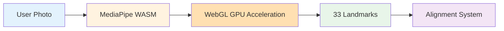
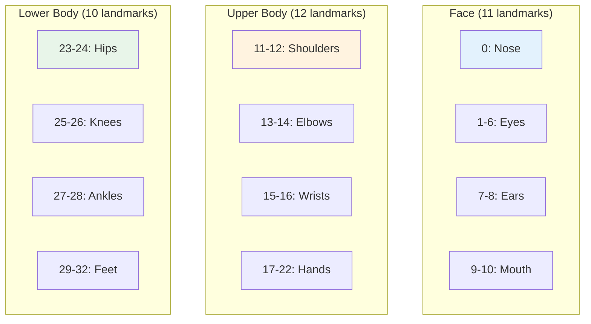
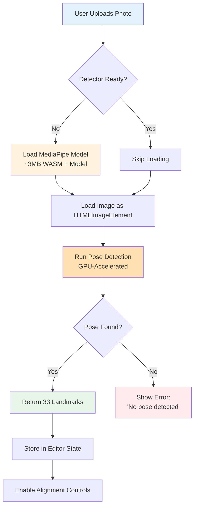

# Pose Detection with MediaPipe

**Version:** 1.0.0
**Last Updated:** 2025-12-22
**Status:** Production

## Scope

This document describes PoseProof's **client-side pose detection system** powered by Google's MediaPipe Pose Landmarker. Pose detection is the foundational technology that enables automatic photo alignment by identifying 33 key body landmarks in fitness photos.

**Key Files:**

- `/lib/mediapipe/pose-detector.ts` - MediaPipe singleton and detection logic
- `/lib/mediapipe/index.ts` - Public API exports
- `/hooks/usePoseDetection.ts` - React hook for pose detection
- `/types/landmarks.ts` - Landmark type definitions and constants

**Privacy-First Architecture:** All pose detection runs **100% client-side** in the browser using WebAssembly and WebGL. Photos are never uploaded to servers, ensuring complete user privacy.

---

## Table of Contents

1. [Overview](#overview)
2. [MediaPipe Architecture](#mediapipe-architecture)
3. [Landmark System](#landmark-system)
4. [Detection Pipeline](#detection-pipeline)
5. [Hook Integration](#hook-integration)
6. [Performance Optimization](#performance-optimization)
7. [Error Handling](#error-handling)
8. [Browser Compatibility](#browser-compatibility)
9. [Debugging Guide](#debugging-guide)
10. [Code References](#code-references)

---

## Overview

### What is Pose Detection?

Pose detection identifies the spatial positions of human body parts in images. PoseProof uses MediaPipe's Pose Landmarker to detect **33 key landmarks** including:

- Face features (nose, eyes, ears, mouth)
- Upper body (shoulders, elbows, wrists, hands)
- Lower body (hips, knees, ankles, feet)

### Why Client-Side ML?

PoseProof processes all photos **in the browser** for three critical reasons:

**Privacy First:**

- Photos never leave the user's device
- No server-side storage or processing
- GDPR/CCPA compliant by design

**Performance:**

- Instant detection (< 500ms on modern devices)
- No network latency
- No upload bandwidth required

**Cost Efficiency:**

- Zero server processing costs
- Unlimited free usage
- Scales automatically with user devices

### Technology Stack



**Components:**

- **MediaPipe Pose Landmarker** - Google's ML model (TensorFlow Lite)
- **WebAssembly (WASM)** - Near-native performance in browser
- **WebGL** - GPU-accelerated inference
- **Lite Model** - Optimized for speed (~3MB)

---

## MediaPipe Architecture

### Model Selection

PoseProof uses the **Pose Landmarker Lite** model:

| Model      | Size  | Speed  | Accuracy | Use Case                   |
| ---------- | ----- | ------ | -------- | -------------------------- |
| **Lite** ✓ | ~3MB  | Fast   | Good     | PoseProof (fitness photos) |
| Full       | ~6MB  | Medium | Better   | Complex poses              |
| Heavy      | ~12MB | Slow   | Best     | Production-grade           |

**Why Lite?** Fitness photos typically show clear full-body poses. The lite model provides sufficient accuracy with faster load times and better mobile performance.

### Singleton Pattern

The pose detector uses a **singleton pattern** to avoid redundant model loading:

```typescript
// Singleton instance (shared across app)
let poseLandmarker: PoseLandmarker | null = null;
let initializationPromise: Promise<PoseLandmarker> | null = null;

export async function initializePoseDetector(): Promise<PoseLandmarker> {
  // Return existing instance if available
  if (poseLandmarker) {
    return poseLandmarker;
  }

  // Return pending initialization if in progress
  if (initializationPromise) {
    return initializationPromise;
  }

  // Start new initialization (only once)
  initializationPromise = (async () => {
    const vision = await FilesetResolver.forVisionTasks(
      "https://cdn.jsdelivr.net/npm/@mediapipe/tasks-vision@latest/wasm",
    );

    poseLandmarker = await PoseLandmarker.createFromOptions(vision, {
      baseOptions: {
        modelAssetPath:
          "https://storage.googleapis.com/mediapipe-models/pose_landmarker/pose_landmarker_lite/float16/1/pose_landmarker_lite.task",
        delegate: "GPU",
      },
      runningMode: "IMAGE",
      numPoses: 1,
      minPoseDetectionConfidence: 0.5,
      minPosePresenceConfidence: 0.5,
      minTrackingConfidence: 0.5,
    });

    return poseLandmarker;
  })();

  return initializationPromise;
}
```

**Benefits:**

- Model loaded only once (3MB download)
- Shared across all photo uploads
- Concurrent initializations wait for single load
- Persists across component re-renders

### Model Configuration

```typescript
PoseLandmarker.createFromOptions(vision, {
  baseOptions: {
    modelAssetPath: "...pose_landmarker_lite.task",
    delegate: "GPU", // WebGL acceleration
  },
  runningMode: "IMAGE", // Static images (not video)
  numPoses: 1, // Single person detection
  minPoseDetectionConfidence: 0.5, // 50% threshold
  minPosePresenceConfidence: 0.5,
  minTrackingConfidence: 0.5,
});
```

**Key Settings:**

- **delegate: 'GPU'** - Enables WebGL acceleration (10-20x faster)
- **numPoses: 1** - Optimized for single-person fitness photos
- **minConfidence: 0.5** - Balanced threshold (filters low-quality detections)

---

## Landmark System

### 33 Key Landmarks

MediaPipe detects 33 body landmarks in **normalized coordinates** (0-1 range):



### Complete Landmark Index

```typescript
export const LANDMARK_INDICES = {
  // Face (0-10)
  NOSE: 0,
  LEFT_EYE_INNER: 1,
  LEFT_EYE: 2,
  LEFT_EYE_OUTER: 3,
  RIGHT_EYE_INNER: 4,
  RIGHT_EYE: 5,
  RIGHT_EYE_OUTER: 6,
  LEFT_EAR: 7,
  RIGHT_EAR: 8,
  MOUTH_LEFT: 9,
  MOUTH_RIGHT: 10,

  // Upper Body (11-22)
  LEFT_SHOULDER: 11,
  RIGHT_SHOULDER: 12,
  LEFT_ELBOW: 13,
  RIGHT_ELBOW: 14,
  LEFT_WRIST: 15,
  RIGHT_WRIST: 16,
  LEFT_PINKY: 17,
  RIGHT_PINKY: 18,
  LEFT_INDEX: 19,
  RIGHT_INDEX: 20,
  LEFT_THUMB: 21,
  RIGHT_THUMB: 22,

  // Lower Body (23-32)
  LEFT_HIP: 23,
  RIGHT_HIP: 24,
  LEFT_KNEE: 25,
  RIGHT_KNEE: 26,
  LEFT_ANKLE: 27,
  RIGHT_ANKLE: 28,
  LEFT_HEEL: 29,
  RIGHT_HEEL: 30,
  LEFT_FOOT_INDEX: 31,
  RIGHT_FOOT_INDEX: 32,
} as const;
```

### Landmark Data Structure

Each landmark contains 4 values:

```typescript
interface Landmark {
  x: number; // 0-1 normalized (horizontal position)
  y: number; // 0-1 normalized (vertical position)
  z: number; // depth (relative to hips)
  visibility: number; // 0-1 confidence score
}
```

**Example Landmark (Nose):**

```typescript
{
  x: 0.512,        // 51.2% from left edge
  y: 0.089,        // 8.9% from top edge
  z: -0.234,       // 23.4cm in front of hip plane
  visibility: 0.98 // 98% confidence
}
```

### Coordinate System

MediaPipe uses **normalized coordinates** (resolution-independent):

```
(0, 0) ─────────────────────► X (1, 0)
  │
  │    (0.5, 0.1) ← Nose (typical)
  │
  │         (0.5, 0.5) ← Body center
  │
  │
  ▼ Y
(0, 1)                    (1, 1)
```

**To convert to pixels:**

```typescript
const pixelX = landmark.x * imageWidth;
const pixelY = landmark.y * imageHeight;
```

### Landmarks Used in Alignment

PoseProof uses 3 key landmarks for photo alignment:

| Index | Name         | Purpose                          |
| ----- | ------------ | -------------------------------- |
| 0     | `NOSE`       | Head position alignment point    |
| 23    | `LEFT_HIP`   | Body height measurement (top)    |
| 27    | `LEFT_ANKLE` | Body height measurement (bottom) |

**Body Height Calculation:**

```typescript
const bodyHeight = Math.abs(
  landmarks[LANDMARK_INDICES.LEFT_ANKLE].y -
    landmarks[LANDMARK_INDICES.LEFT_HIP].y,
);
```

---

## Detection Pipeline

### High-Level Flow



### Step-by-Step Pipeline

#### 1. Initialization (First Use Only)

```typescript
// Triggered on first detection
const detector = await initializePoseDetector();

// Downloads (cached by browser):
// - WASM runtime (~500KB)
// - Pose model (~3MB)
// Total: ~3.5MB one-time download
```

**Timeline:**

- **First load:** 2-5 seconds (model download)
- **Subsequent loads:** Instant (browser cache)

#### 2. Image Loading

```typescript
export async function detectPoseFromDataUrl(
  dataUrl: string,
): Promise<PoseResult> {
  return new Promise((resolve, reject) => {
    const img = new Image();

    img.onload = async () => {
      const result = await detectPose(img);
      resolve(result);
    };

    img.onerror = () => {
      reject(
        new PoseDetectionError(
          PoseDetectionErrorType.INVALID_IMAGE,
          "Failed to load image for pose detection.",
        ),
      );
    };

    img.src = dataUrl;
  });
}
```

**Supported Sources:**

- Data URLs (base64)
- HTMLImageElement
- HTMLCanvasElement
- ImageBitmap

#### 3. Pose Detection

```typescript
const result: PoseLandmarkerResult = detector.detect(imageSource);

// result.landmarks[0] = array of 33 landmarks
// result.worldLandmarks[0] = 3D coordinates (optional)
```

**Processing Time:**

- Desktop: 50-150ms
- Mobile: 200-500ms
- GPU-accelerated via WebGL

#### 4. Result Processing

```typescript
// Convert to our Landmark type
const landmarks: Landmark[] = result.landmarks[0].map((lm) => ({
  x: lm.x,
  y: lm.y,
  z: lm.z,
  visibility: lm.visibility ?? 0,
}));

return {
  landmarks,
  worldLandmarks: result.worldLandmarks?.[0]?.map(/* ... */),
};
```

#### 5. Validation

```typescript
if (!result.landmarks || result.landmarks.length === 0) {
  throw new PoseDetectionError(
    PoseDetectionErrorType.NO_POSE_DETECTED,
    "No pose detected in the image. Please ensure a person is visible.",
  );
}
```

**Common Failure Cases:**

- No person in photo
- Person too small/far away
- Heavy cropping (missing key landmarks)
- Poor lighting/blur

---

## Hook Integration

### usePoseDetection Hook

React hook for component-level pose detection:

```typescript
const {
  isReady, // Model loaded and ready
  isDetecting, // Detection in progress
  error, // Error message (if any)
  errorType, // Error type enum
  detect, // Detect function
  initialize, // Manual initialization
  clearError, // Clear error state
} = usePoseDetection();
```

### Initialization (Automatic)

```typescript
// Hook initializes detector on mount
useEffect(() => {
  const init = async () => {
    await initializePoseDetector();
    setIsReady(true);
  };

  if (isPoseDetectorReady()) {
    setIsReady(true); // Already loaded
  } else {
    init(); // Load model
  }
}, []);
```

**Result:**

- `isReady: false` → Loading model
- `isReady: true` → Ready to detect

### Detection Usage

```typescript
// Detect pose from data URL
const handleUpload = async (dataUrl: string) => {
  const landmarks = await detect(dataUrl);

  if (landmarks) {
    // Success: 33 landmarks returned
    console.log("Nose:", landmarks[0]);
    console.log("Left Hip:", landmarks[23]);
  } else {
    // Failure: Check error and errorType
    console.error(error);
  }
};
```

### Error Handling

```typescript
const { error, errorType, clearError } = usePoseDetection();

// Display error to user
if (error) {
  return (
    <div>
      <p>{error}</p>
      <button onClick={clearError}>Dismiss</button>
    </div>
  );
}

// Handle specific error types
switch (errorType) {
  case PoseDetectionErrorType.NO_POSE_DETECTED:
    // Show "Try another photo" message
    break;
  case PoseDetectionErrorType.INITIALIZATION_FAILED:
    // Show "Check internet connection" message
    break;
  case PoseDetectionErrorType.INVALID_IMAGE:
    // Show "Invalid image format" message
    break;
}
```

### Real-World Example (DropZone)

```typescript
const DropZone = () => {
  const { detect, isDetecting, error } = usePoseDetection();
  const { setBeforeImage, setAfterImage } = useEditorStore();

  const handleDrop = async (file: File, slot: 'before' | 'after') => {
    // Convert file to data URL
    const dataUrl = await fileToDataUrl(file);

    // Detect pose
    const landmarks = await detect(dataUrl);

    if (!landmarks) {
      toast.error(error || 'Failed to detect pose');
      return;
    }

    // Store in editor state
    if (slot === 'before') {
      setBeforeImage({ dataUrl, landmarks });
    } else {
      setAfterImage({ dataUrl, landmarks });
    }

    toast.success('Pose detected!');
  };

  return (
    <div>
      {isDetecting && <Spinner />}
      {/* ... drop zone UI ... */}
    </div>
  );
};
```

---

## Performance Optimization

### Model Caching

**Browser Cache Headers:**
MediaPipe models are served with long cache times:

```
Cache-Control: public, max-age=31536000, immutable
```

**Result:**

- First load: 2-5 seconds (download)
- Subsequent loads: < 100ms (cache hit)

### GPU Acceleration

**WebGL Delegate:**

```typescript
delegate: "GPU"; // 10-20x faster than CPU
```

**Requirements:**

- WebGL 2.0 support
- Hardware GPU (Intel/AMD/NVIDIA)
- Not blocked by browser settings

**Fallback:**
If GPU unavailable, MediaPipe falls back to CPU (slower but functional).

### Singleton Pattern Benefits

**Memory Efficiency:**

- Model loaded once: ~10MB memory
- Shared across all components
- No redundant instances

**Performance:**

- Initialization: 1x per app lifecycle
- Detection: Instant (no model loading)

### Best Practices

**1. Preload on App Mount**

```typescript
// App.tsx or _app.tsx
useEffect(() => {
  initializePoseDetector(); // Preload before user uploads
}, []);
```

**2. Detect in Web Workers (Future)**

```typescript
// Move detection off main thread
const worker = new Worker("pose-worker.js");
worker.postMessage({ image: dataUrl });
worker.onmessage = (e) => {
  const landmarks = e.data;
};
```

**3. Batch Processing**

```typescript
// Detect multiple photos efficiently
const results = await Promise.all([
  detect(photo1),
  detect(photo2),
  detect(photo3),
]);
```

**4. Abort Stale Detections**

```typescript
// Cancel detection if user navigates away
const abortController = new AbortController();

useEffect(() => {
  return () => abortController.abort();
}, []);
```

### Performance Benchmarks

| Device              | GPU        | Detection Time | Model Load |
| ------------------- | ---------- | -------------- | ---------- |
| MacBook Pro M1      | Integrated | 50-80ms        | 1.2s       |
| iPhone 13           | Apple GPU  | 120-200ms      | 2.1s       |
| Desktop (RTX 3060)  | NVIDIA     | 30-60ms        | 0.9s       |
| Android (Mid-range) | Adreno 618 | 300-500ms      | 3.5s       |
| CPU Only            | None       | 800-1500ms     | 2.0s       |

**Target:** < 500ms detection time on 90% of devices

---

## Error Handling

### Error Types

```typescript
export enum PoseDetectionErrorType {
  INITIALIZATION_FAILED = "INITIALIZATION_FAILED",
  MODEL_LOAD_FAILED = "MODEL_LOAD_FAILED",
  DETECTION_FAILED = "DETECTION_FAILED",
  NO_POSE_DETECTED = "NO_POSE_DETECTED",
  INVALID_IMAGE = "INVALID_IMAGE",
}
```

### Error Class

```typescript
export class PoseDetectionError extends Error {
  constructor(
    public type: PoseDetectionErrorType,
    message: string,
    public originalError?: unknown,
  ) {
    super(message);
    this.name = "PoseDetectionError";
  }
}
```

### Error Scenarios

#### 1. Initialization Failed

**Cause:**

- Network error loading WASM/model
- CORS issues
- CDN unavailable

**User Message:**

> "Failed to initialize pose detection. Please check your internet connection and try again."

**Recovery:**

```typescript
try {
  await initialize();
} catch (err) {
  // Show retry button
  // Fallback to manual alignment mode
}
```

#### 2. No Pose Detected

**Cause:**

- No person in photo
- Person too small/far away
- Heavy cropping

**User Message:**

> "No pose detected in the image. Please ensure a person is visible in the photo."

**Recovery:**

- Let user try another photo
- Show example of good photo

#### 3. Invalid Image

**Cause:**

- Corrupted file
- Unsupported format
- File read error

**User Message:**

> "Failed to load image for pose detection."

**Recovery:**

- Let user upload again
- Check file format/size

#### 4. Detection Failed

**Cause:**

- Unexpected runtime error
- GPU context lost
- Browser compatibility issue

**User Message:**

> "Failed to detect pose in the image. Please try with a different photo."

**Recovery:**

```typescript
// Try reinitialization
closePoseDetector();
await initializePoseDetector();
await detect(dataUrl);
```

### Error Handling Pattern

```typescript
try {
  const landmarks = await detect(dataUrl);

  if (!landmarks) {
    // Check error and errorType from hook
    switch (errorType) {
      case PoseDetectionErrorType.NO_POSE_DETECTED:
        showTip("Make sure full body is visible");
        break;
      case PoseDetectionErrorType.INITIALIZATION_FAILED:
        showRetryButton();
        break;
      default:
        showGenericError();
    }
    return;
  }

  // Success: process landmarks
  processLandmarks(landmarks);
} catch (err) {
  // Unexpected error
  logError(err);
  showFallbackUI();
}
```

---

## Browser Compatibility

### Supported Browsers

| Browser        | Version | WebGL 2.0 | WASM | Status             |
| -------------- | ------- | --------- | ---- | ------------------ |
| Chrome         | 91+     | ✓         | ✓    | ✅ Fully Supported |
| Firefox        | 89+     | ✓         | ✓    | ✅ Fully Supported |
| Safari         | 15+     | ✓         | ✓    | ✅ Fully Supported |
| Edge           | 91+     | ✓         | ✓    | ✅ Fully Supported |
| Mobile Safari  | iOS 15+ | ✓         | ✓    | ✅ Fully Supported |
| Chrome Android | 91+     | ✓         | ✓    | ✅ Fully Supported |

### Feature Detection

```typescript
// Check WebGL support
function hasWebGLSupport(): boolean {
  try {
    const canvas = document.createElement("canvas");
    return !!(
      canvas.getContext("webgl2") || canvas.getContext("experimental-webgl2")
    );
  } catch (e) {
    return false;
  }
}

// Check WASM support
function hasWasmSupport(): boolean {
  try {
    if (typeof WebAssembly === "object") {
      const module = new WebAssembly.Module(
        Uint8Array.of(0x0, 0x61, 0x73, 0x6d, 0x01, 0x00, 0x00, 0x00),
      );
      return module instanceof WebAssembly.Module;
    }
  } catch (e) {
    return false;
  }
  return false;
}
```

### Graceful Degradation

**If GPU Unavailable:**

```typescript
// MediaPipe automatically falls back to CPU
delegate: "GPU"; // Uses CPU if GPU unavailable
```

**If WASM Unavailable:**

- Show "Browser not supported" message
- Recommend Chrome/Firefox/Safari
- No fallback (WASM required)

### Mobile Considerations

**iOS Safari:**

- WebGL context limits (8 contexts max)
- Memory pressure warnings
- Background tab suspension

**Android Chrome:**

- GPU driver variations
- Memory constraints on budget devices
- WebView compatibility

**Best Practices:**

```typescript
// Detect mobile
const isMobile = /iPhone|iPad|Android/i.test(navigator.userAgent);

// Adjust settings for mobile
const config = {
  numPoses: 1,
  minPoseDetectionConfidence: isMobile ? 0.6 : 0.5,
};
```

---

## Debugging Guide

### Enable Verbose Logging

```typescript
// Add to pose-detector.ts
const DEBUG = process.env.NODE_ENV === "development";

if (DEBUG) {
  console.log("Initializing pose detector...");
  console.log("Model loaded:", poseLandmarker !== null);
  console.log("Detection time:", Date.now() - startTime, "ms");
  console.log("Landmarks:", result.landmarks[0]);
}
```

### Visualize Landmarks

```typescript
// Draw landmarks on canvas for debugging
function drawLandmarks(canvas: HTMLCanvasElement, landmarks: Landmark[]) {
  const ctx = canvas.getContext("2d")!;

  landmarks.forEach((lm, i) => {
    const x = lm.x * canvas.width;
    const y = lm.y * canvas.height;

    // Draw point
    ctx.fillStyle = lm.visibility > 0.5 ? "green" : "red";
    ctx.beginPath();
    ctx.arc(x, y, 5, 0, 2 * Math.PI);
    ctx.fill();

    // Draw label
    ctx.fillStyle = "white";
    ctx.fillText(i.toString(), x + 8, y + 8);
  });
}
```

### Common Issues

#### Issue: "No pose detected" on valid photos

**Diagnosis:**

- Check visibility scores: `landmarks[0].visibility`
- Check landmark count: `landmarks.length === 33`

**Solution:**

```typescript
// Lower confidence threshold
minPoseDetectionConfidence: 0.3; // Was 0.5
```

#### Issue: Slow detection (> 1 second)

**Diagnosis:**

```typescript
console.log("WebGL:", hasWebGLSupport());
console.log("GPU delegate:", detector.delegate);
```

**Solution:**

- Check GPU acceleration enabled
- Check browser WebGL support
- Close other GPU-intensive tabs

#### Issue: Model fails to load

**Diagnosis:**

```typescript
// Check network
fetch(
  "https://cdn.jsdelivr.net/npm/@mediapipe/tasks-vision@latest/wasm/vision_wasm_internal.wasm",
)
  .then((res) => console.log("WASM accessible:", res.ok))
  .catch((err) => console.error("WASM blocked:", err));
```

**Solution:**

- Check firewall/proxy settings
- Check CORS configuration
- Try alternative CDN

#### Issue: Memory leaks

**Diagnosis:**

```typescript
// Monitor detector lifecycle
console.log("Detector initialized:", poseLandmarker !== null);
console.log("Initialization promise:", initializationPromise !== null);
```

**Solution:**

```typescript
// Close detector when unmounting
useEffect(() => {
  return () => {
    if (shouldCleanup) {
      closePoseDetector();
    }
  };
}, []);
```

### DevTools Performance Profiling

**Chrome DevTools:**

1. Open Performance tab
2. Record during photo upload
3. Look for "detectPose" function calls
4. Check WebGL context creation
5. Monitor memory usage

**Expected Profile:**

- Model loading: 1-3 seconds (first time)
- Detection: 50-500ms per image
- Memory: ~10MB stable after init

---

## Code References

### Core Files

**`/lib/mediapipe/pose-detector.ts`** (160 lines)

- `initializePoseDetector()` - Singleton initialization
- `detectPose()` - Core detection function
- `detectPoseFromDataUrl()` - Detect from data URL
- `isPoseDetectorReady()` - Check ready state
- `closePoseDetector()` - Cleanup

**`/lib/mediapipe/index.ts`** (6 lines)

- Public API exports

**`/hooks/usePoseDetection.ts`** (120 lines)

- `usePoseDetection()` - React hook for pose detection
- Handles loading states, errors, and detection flow

**`/types/landmarks.ts`** (80 lines)

- `Landmark` interface
- `LANDMARK_INDICES` constants
- `PoseResult` interface
- `PoseDetectionError` class

### Related Files

**`/components/features/editor/DropZone.tsx`**

- Integrates pose detection on photo upload

**`/lib/canvas/alignment.ts`**

- Uses landmarks for alignment calculations

**`/stores/editor-store.ts`**

- Stores detected landmarks in state

### External Documentation

**MediaPipe Pose Landmarker:**

- [Official Guide](https://developers.google.com/mediapipe/solutions/vision/pose_landmarker)
- [Model Card](https://storage.googleapis.com/mediapipe-models/pose_landmarker/pose_landmarker_lite/float16/1/pose_landmarker_lite.json)
- [Web API Reference](https://developers.google.com/mediapipe/api/solutions/js/tasks-vision.poselandmarker)

**WebGL & WASM:**

- [WebGL 2.0 Specification](https://www.khronos.org/registry/webgl/specs/latest/2.0/)
- [WebAssembly Docs](https://developer.mozilla.org/en-US/docs/WebAssembly)

---

## Future Enhancements

### Planned Improvements

**1. Multi-Person Detection**

```typescript
// Support group photos
numPoses: 4; // Detect up to 4 people
```

**2. Real-Time Video Detection**

```typescript
// Switch to video mode for live preview
runningMode: "VIDEO";
```

**3. Custom Landmark Subsets**

```typescript
// Only detect upper body for face-focused shots
outputSegmentationMasks: false;
outputBodyPresence: true;
```

**4. Pose Classification**

```typescript
// Classify pose type (standing, sitting, side view)
import { PoseClassifier } from "@mediapipe/pose-classifier";
```

**5. Enhanced Error Recovery**

- Automatic retry with exponential backoff
- Offline model caching (Service Worker)
- Progressive WASM loading

---

**Document Status:** Production-ready
**Maintainer:** PoseProof Engineering
**Last Review:** 2025-12-22
